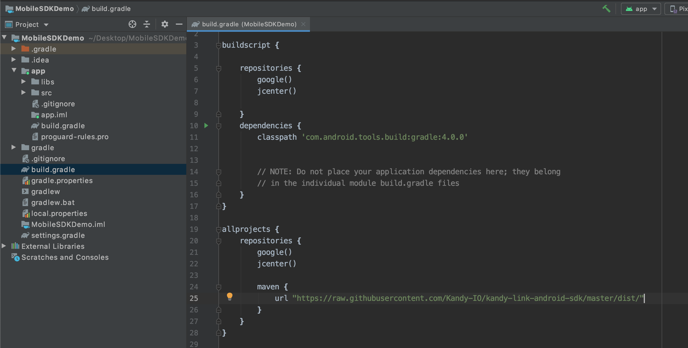
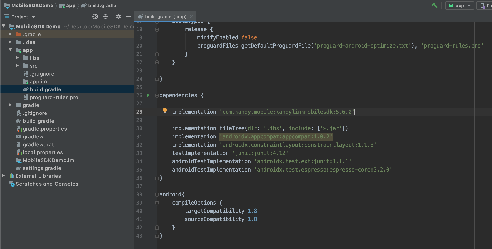
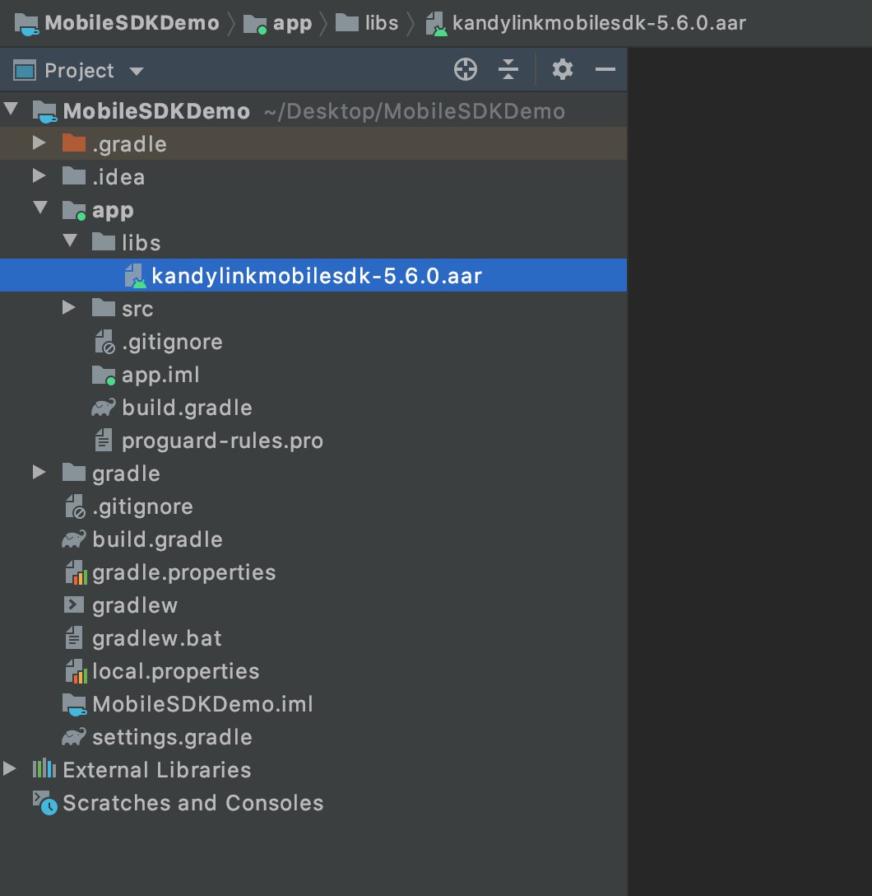
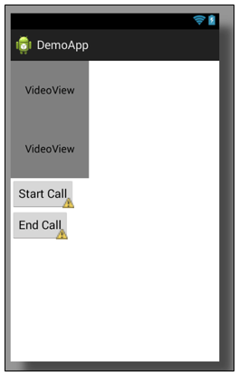
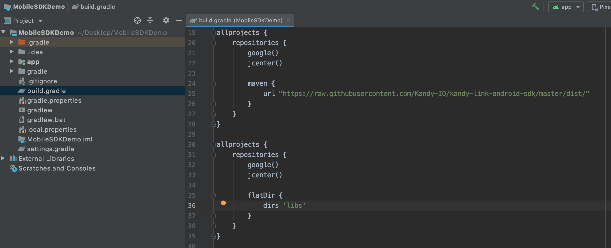

# Mobile SDK User Guide for Android
Version Number: **5.0.0**
<br>
Revision Date: **September 30, 2019**

## Mobile SDK overview

The SPiDR/Kandy Link Mobile Software Development Kit (SDK) defines a library implementation supporting SPiDR platform features like registration, notification, call management, instant message, presence management, and WebRTC on Android. You can use this library implementation to integrate SPiDR/Kandy Link services and WebRTC into your native mobile applications to create new, innovative user experiences.

The Mobile SDK has the following characteristics:

* supports REST over HTTP/HTTPS for integration with the presentation layer of SPiDR/Kandy Link
* supports WebSocket for notification
* built and distributed as a standard library structure for easy use in mobile applications
* most features are implemented based on factory and singleton design patterns
* access to REST APIs provided by Ribbon's Kandy platform

See [Appendix A: High-level Mobile SDK structure](#appendix-a-high-level-mobile-sdk-structure) for a high-level view of the Mobile SDK and its sub-modules.

The Mobile SDK for Android is compatible with Android 4.1.x-9.x and has been tested on the Nexus 7, Nexus 5, Samsung Note 3, Samsung Note 5, Samsung S7, HTC Desire 626, HTC One A9, HTC 10, LG G2, LG G3, LG G5, LG G6, SONY XPERIA Z5, SONY XPERIA XZ, General Mobile GM 5+.

### What's in this document?

This document provides help getting started developing your mobile application using the Mobile SDK for Android. This guide contains:

* Steps to create your Android project using the Mobile SDK
* Sample code to illustrate common tasks

<div class="page-break"></div>

### Before you start developing your application

The following items need to be complete prior to beginning work on your application:

* Your Android Studio development environment is set up and ready for new projects.
* You are familiar with Android development fundamentals.
* You know the IP address and port of the SPiDR/Kandy Link server.

<div class="page-break"></div>

## Get Started

This section provides an example of creating your Android project and using the Mobile SDK in your project. Android Studio 3.4.2 is used for this example, but you may use your development environment of choice to create your project.

### Create your Android project

The following procedure uses Android Studio IDE to create a simple application which can use MobileSDK.   

1. Open the development environment (in this example, Android Studio).
2. Click **Start a new Android Studio project**.
 
 
3. Select an activity or leave as default (Empty Activity) and click **Next**.

	

4. Fill in the configurations for your project.

 * Type your project's **Name**, **Package name** and **Save location**. Select the **Language** you prefer your project.

 * Select minimum Android SDK version for phone and tablet (API Level 16 is recommended).

    Note that, this is the minimum Android SDK API version that the demo application supports.

    For the target SDK version, Please check Google suggestion from the [link](https://developer.android.com/distribute/best-practices/develop/target-sdk). Target SDK can be changed on **build.gradle** file after the project creation.

	


### Adding MobileSDK dependency to your project

There are 2 option to add MobileSDK dependency to your project. You can add MobileSDK dependency from github repository or you can add it your project manually. This document will explain both options in detail. 


#### Adding MobileSDK dependency to your project from GitHub repository
1. Add MobileSDK repository url to your root level **build.gradle** file. 


	```
	allprojects {
    	repositories {
        	google()
        	jcenter()

        	maven {
         	  url "https://raw.githubusercontent.com/Kandy-IO/kandy-link-android-sdk/master/dist/"
        	}
   		}
	}
	```
	


2. Add dependcy of MobileSDK to your app level **build.gradle** file.

	```
	implementation 'com.kandy.mobile:kandylinkmobilesdk:{version}'

	```

	

	---
	**NOTE**

	Check latest version of MobileSDK from [GitHub](https://github.com/Kandy-IO/kandy-link-android-sdk). 

	---


#### Adding MobileSDK dependency to your project manually


1. Download latest MobileSDK version from [GitHub](https://github.com/Kandy-IO/kandy-link-android-sdk) and copy **aar** file to your project **lib** folder.

 


2. After that you need to inform gradle that your app will use manual aar files. To do that add **flatDir** path to your root level **build.gradle** file as in the example above.

	```
	flatDir {
       dirs 'libs'
   }
	```
 

3. Add dependcy of MobileSDK to your app level **build.gradle** file with **@aar** prefix.

	```
	implementation 'com.kandy.mobile:kandylinkmobilesdk:{version}@aars'

	```

	


### Adding Java 8 support
 An Android application project must be compatible with Java 8 when it is using Mobile SDK library. This necessity comes from the WebRTC library, its code is dependent on some Java 8 features. In order to set this compliance, open **build.gradle** file, located under **app** module of **MobileSDKDemoApp** project. Add the configuration script below to the file.

	```	
	android{
		compileOptions {
        targetCompatibility 1.8
        sourceCompatibility 1.8
    }
	}
	```
	



### Use the Mobile SDK in your Android project

Once the library is attached to the Android project, the Mobile SDK can be used by defining the necessary import items.

The following is an example using the Mobile SDK in Android:

1. Locate and open **AndroidManifest.xml**.


2. Add the following permissions to the manifest file:

```xml
<uses-feature android:glEsVersion="0x00020000" android:required="true" />
<uses-feature android:name="android.hardware.camera" />
<uses-feature android:name="android.hardware.camera.autofocus" />

<uses-permission android:name="android.permission.INTERNET" />
<uses-permission android:name="android.permission.ACCESS_NETWORK_STATE" />
<uses-permission android:name="android.permission.MODIFY_AUDIO_SETTINGS" />
<uses-permission android:name="android.permission.RECORD_AUDIO" />
<uses-permission android:name="android.permission.CAMERA" />
```

3. In your project folder, navigate to **res** > **layout** and open **activity_main.xml** to create your UI.


4. You can create your UI in a graphical mode (if available) or in xml editor mode. In this example, editing will be done in the xml view.

5. Choose a layout for your UI. In Android, developers can use a variety of layouts for UI. In this example, we will use LinearLayout (Vertical) for the UI and set the orientation vertical. The example layout below also contains two buttons and two video views in the LinearLayout.

```xml
<?xml version="1.0" encoding="utf-8"?>
<LinearLayout xmlns:android="http://schemas.android.com/apk/res/android"
              android:layout_width="match_parent"
              android:layout_height="match_parent"
              android:orientation="vertical">

    <com.genband.mobile.core.webrtc.view.VideoView
        android:id="@+id/remoteVideoView"
        android:layout_width="120dp"
        android:layout_height="90dp"
        />

    <com.genband.mobile.core.webrtc.view.VideoView
        android:id="@+id/localVideoView"
        android:layout_width="120dp"
        android:layout_height="90dp"
        />

    <Button
        android:id="@+id/startVideoButton"
        android:layout_width="wrap_content"
        android:layout_height="wrap_content"
        android:text="Start Call"
        />

    <Button
        android:id="@+id/stopVideoButton"
        android:layout_width="wrap_content"
        android:layout_height="wrap_content"
        android:text="End Call"
        />
</LinearLayout>
```


6. Open the MainActivity. If project has no activity, create one.

```java
public class MainActivity extends Activity {

    @Override
    protected void onCreate(Bundle savedInstanceState) {
        super.onCreate(savedInstanceState);
        setContentView(R.layout.activity_main);
    }
}
```

7. Define the configuration attributes.

```java
public void configExample() {
    Configuration configuration = Configuration.getInstance();
    configuration.setUsername("alice@rbbn.com");
    configuration.setPassword("password");
    configuration.setRestServerIp("rbbn.com/mobilesdkdemoapp");
    configuration.setRestServerPort(443);
    configuration.setRequestHttpProtocol(false);

    ICEServers iceServers = new ICEServers();
    iceServers.addICEServer("stun: rbbn.com/mobilesdkdemoapp:3478");
    configuration.setICEServers(iceServers);

    configuration.setWebSocketServerIp("rbbn.com/mobilesdkdemoapp");
    configuration.setWebSocketServerPort(443);
    configuration.setSecuredWSProtocol(true);
}
```

8. Define a register() method to provide client registration by calling the registration and registration notification methods.

```java
public void register() {
    RegistrationApplicationListener registrationListener = new RegistrationApplicationListener() {
        @Override
        public void registrationStateChanged(RegistrationStates state) {
            // Handle registration state changes
        }

        @Override
        public void notificationStateChanged(NotificationStates state) {
            // Handle notification state changes
        }

        @Override
        public void onInternalError(MobileError mobileError) {
            // Handle internal errors
        }
    };

    ServiceProvider serviceProvider = ServiceProvider.getInstance(getApplicationContext());
    final RegistrationService registrationService = serviceProvider.getRegistrationService();
    //Get registration notifications
    registrationService.setRegistrationApplicationListener(registrationListener);
    //Service types used in registration
    Constants.SubscribeServices[] subscribeServices = {Constants.SubscribeServices.Call,
            Constants.SubscribeServices.Presence,
            Constants.SubscribeServices.IM};
    registrationService.registerToServer(subscribeServices, 3600, new OnCompletionListener() {
        @Override
        public void onSuccess() {
            //Handle registration success
            //Developer can get expiration time, which is gathered from registration response
            int expirationTime = registrationService.getExpirationTime();
        }

        @Override
        public void onFail(MobileError error) {
            //Handle registration error
        }
    });
}
```

9. Define a global variable call.

```java
CallInterface call;
```

10. Implement onSuccess() method of OnCompleteListener so that an outgoing call will be triggered after a successful registration.

```java
registrationService.registerToServer(subscribeServices, 3600, new OnCompletionListener() {
    @Override
    public void onSuccess() {
        ServiceProvider serviceProvider = ServiceProvider.getInstance(getApplicationContext());
        CallServiceInterface callService = serviceProvider.getCallService();
        try {
            callService.setCallApplication(MainActivity.this);
        } catch (MobileException exception) {
        }
        callService.createOutgoingCall("alice@rbbn.com", "bob@rbbn.com",
                MainActivity.this, new OutgoingCallCreateInterface() {
                    @Override
                    public void callCreated(OutgoingCallInterface callInterface) {
                        call = callInterface;
                        callInterface.setLocalVideoView((VideoView)
                                findViewById(R.id.localVideoView));
                        callInterface.setRemoteVideoView((VideoView)
                                findViewById(R.id.remoteVideoView));
                        callInterface.establishCall(true);
                    }

                    @Override
                    public void callCreationFailed(MobileError error) {
                    }
                });
    }

    @Override
    public void onFail(MobileError error) {
        //Handle registration error
    }
});
```

11. The Call service uses callbacks to publish response events. To receive callbacks, a class must implement the necessary interface.

  Modify the activity class to implement the interface.

```java
public class MainActivity extends Activity
        implements CallApplicationListener {

.
.
.

}
```

12. Bind the register() method with the start video button.

```java
Button startCall = (Button) findViewById(R.id.startVideoButton);
startCall.setOnClickListener(new View.OnClickListener() {
    @Override
    public void onClick(View v) {
        register();
    }
});
```

13. Define stopCall() method.

```java
public void stopCall() throws MobileException {
    if(call != null) {
        call.endCall();
    }
}
```

14. Override the endCallSucceeded() callback method so that an unregister operation is triggered when the call ends.

```java
@Override
public void endCallSucceeded(CallInterface call) {
    ServiceProvider serviceProvider = ServiceProvider.getInstance(getApplicationContext());
    RegistrationService registrationService = serviceProvider.getRegistrationService();
    registrationService.unregisterFromServer(new OnCompletionListener() {
        @Override
        public void onSuccess() {
            //Handle unregistration success
        }

        @Override
        public void onFail(MobileError error) {
            //Handle unregistration error
        }
    });
}
```

15. Bind the stopCall method with the stop video button.

```java
Button stopCall = (Button) findViewById(R.id.stopVideoButton);
stopCall.setOnClickListener(new View.OnClickListener() {
    @Override
    public void onClick(View v) {
        try {
            stopCall();
        }
        catch (MobileException exception) {
        }
    }
});
```

16. Run the demo application.


<div class="page-break"></div>

### Enable background processing

The application must support background processing while on an active call, allowing SDK to process WebSocket operations even after the user presses the Home button, the Sleep/Wake button, or if another application is launched. Implement triggers for related activities (e.g. video call) to respond to Android's activity life-cycle events (e.g. pause/resume).

###### Example: Implement triggers for background processing

```java
@Override
protected void onPause()
{
    super.onPause();
    SDKEventManager.handleEvent(SDKEvents.EVENT_BACKGROUND);
}

@Override
protected void onResume()
{
    super.onResume();
    SDKEventManager.handleEvent(SDKEvents.EVENT_FOREGROUND);
}
```

<div style="border-style:solid; page-break-inside: avoid;">
<h5>WARNING</h5>
Android may kill an activity under certain conditions (e.g while the application or activity is in the background).
This behavior causes VideoView objects to be disposed; Therefore, both local and remote VideoView objects must be set again when activity resumes from the background.
<br/><br/>
If there is more than one call object, video views must be set again for each of the call objects.
</div>

Use the onResume function to set all video views.

###### Example: Set all views

```java
@Override
protected void onResume()
{
    super.onResume();
    SDKEventManager.handleEvent(SDKEvents.EVENT_FOREGROUND);
    call.setLocalVideoView((VideoView)findViewById(R.id.localVideoView));
    call.setRemoteVideoView((VideoView)findViewById(R.id.remoteVideoView));
    call2.setLocalVideoView((VideoView)findViewById(R.id.localVideoView2));
    call2.setRemoteVideoView((VideoView)findViewById(R.id.remoteVideoView2));
}
```

<div class="page-break"></div>

### Set up application configuration

First, you must access and modify the Configuration utility to update attributes such as username, password, REST server IP, etc. The Mobile SDK receives data from the Configuration utility, and the third-party mobile application (third-party app) must provide necessary data to the Configuration utility. Example for basic configuration that needs Mobile SDK to work is shown in next page.

To see all available configurations, see [Appendix D: Detailed Configurations](#appendix-d-detailed-configurations).

<div class="page-break"></div>

###### Example: Accessing and updating Configuration

```java
public class Demo {
    public void configurationExample() {
        //Configuration.getInstance is used to access the static Configuration instance
        //Access Configuration values through Java Beans getter/setter approach
        Configuration configuration = Configuration.getInstance();

        //set minimum Configuration values

        //user name for authorization (minimum Configuration item setting)
        configuration.setUsername("username");
        //password for authorization
        configuration.setPassword("password");
        //server IP value for SPiDR/Kandy Link
        configuration.setRestServerIp("127.0.0.1");
        //server port value for SPiDR/Kandy Link
        configuration.setRestServerPort(443);

         //IP used in websocket connection creation
        configuration.setWebSocketServerIp("127.0.0.1");
        //port used in websocket connection creation
        configuration.setWebSocketServerPort(443);

        // SPiDR/Kandy Link TURN server using udp transport in WebRTC's peer connection
        ICEServers iceServers = new ICEServers();
        iceServers.addICEServer("turns:turn.spidr.com:443?transport=tcp");
        iceServers.addICEServer("stun:stun1.spidr.com:3478?transport=udp");
        configuration.setICEServers(iceServers);
    }
}
```

### Set up logging functionality

Logging provides a way to trace process execution. The Log Manager is defined to handle logging requests made by the Mobile SDK. The Log Manager does not process the logging messages, rather it receives logging message requests and delivers them to the logger defined in the Configuration utility (logger is initially "null"; you must set an object which conforms to LoggingInterface methods in the Configuration utility).

The Mobile SDK supports the following log levels:

* ERROR (all exceptions are logged at this level)
* WARNING
* INFO (used for tracing issues)
* TRACE
* VERBOSE
* TRACE_WEBRTC

###### Example: Define logger

```java
public class LogUtilityExample implements LoggingInterface {

    @Override
    public void log(LogLevel loglevel, String tag, String message) {
        if(loglevel == LogLevel.ERROR) {
            Log.e(tag, message);
        } else if(loglevel == LogLevel.WARNING) {
            Log.w(tag, message);
        } else if(loglevel == LogLevel.INFO) {
            Log.i(tag, message);
        } else {
            Log.d(tag, message);
        }
    }
}
```

###### Example: Initialize logger

```java
public void initializeAndUseLogger() {
	Configuration.getInstance().setLogger(new LogUtilityExample());
	LogManager.log(LogLevel.INFO, "Test", "logger is initialized");
}
```

<div class="page-break"></div>

## Registration Service

MobileSDK should be registered to SPiDR/Kandy Link before using any other services.

### Register the client

Use the `registerToServer` method to register the client to the server with the values set in configuration. Failure and success calls are transmitted by the `OnCompletionListener` interface, which can be `null`. The `onSuccess` callback of the `RegistrationApplicationListener` is called after the registration request succeeds and the notification channel is connected.

After the client is registered, the notification state is "CONNECTED", and the registered state is "REGISTERED". The client will try to stay in "REGISTERED" and "CONNECTED" states until the client is unregistered.

The registration service renews registration according to the expiration time with the help of SPiDR/Kandy Link's ping messages. The `getExpirationTime` method may be called after successful registration to retrieve the expiration time (in seconds) for registration.


###### Example: Registering to SPiDR/Kandy Link

```java
RegistrationApplicationListener registrationListener = new RegistrationApplicationListener() {
    @Override
    public void registrationStateChanged(RegistrationStates state) {
        // Handle registration state changes
    }

    @Override
    public void notificationStateChanged(NotificationStates state) {
        // Handle notification state changes
    }
};

final RegistrationService registrationService
         = ServiceProvider.getInstance(getApplicationContext()).getRegistrationService();
//Get registration notifications
registrationService.setRegistrationApplicationListener(registrationListener);
//Service types used in registration
SubscribeServices[] subscribeServices = {SubscribeServices.Call,
        SubscribeServices.Presence,
        SubscribeServices.IM};
registrationService.registerToServer(subscribeServices, 3600,
        new OnCompletionListener() {
    @Override
    public void onSuccess() {
        //Handle registration success
        //Developer can get expiration time, which is gathered from registration response
        int expirationTime = registrationService.getExpirationTime();
    }

    @Override
    public void onFail(MobileError error) {
        //Handle registration error
    }
});
```

### Unregister the client

Use the unregisterFromServer method to unregister the client from the server. Failure and success calls are transmitted by the `OnCompletionListener` interface, which can be null. After the client is unregistered, the notification state is "DISCONNECTED", and the registered state is "UNREGISTERED".

###### Example: Unregistering from SPiDR/Kandy Link

```java
RegistrationApplicationListener registrationListener = new RegistrationApplicationListener() {
    @Override
    public void registrationStateChanged(RegistrationStates state) {
        // Handle registration state changes
    }

    @Override
    public void notificationStateChanged(NotificationStates state) {
        // Handle notification state changes
    }
};

final RegistrationService registrationService = ServiceProvider.getInstance(getApplicationContext()).getRegistrationService();

registrationService.unregisterFromServer(new OnCompletionListener() {
    @Override
    public void onSuccess() {
        //Handle unregistration success
    }

    @Override
    public void onFail(MobileError error) {
        //Handle unregistration error
    }
});
```

<div class="page-break"></div>

### Register the client with AuthName

If client wants to register with using "Authorization Name", `authorizationName` configuration in `Configuration` should be set before registration.

###### Example: Registering with using Authorization Name

```java

final RegistrationService registrationService
         = ServiceProvider.getInstance(getApplicationContext()).getRegistrationService();

//Set AuthName
Configuration.getInstance().setAuthorizationName("AuthName");
Configuration.getInstance().setUsername("username");
Configuration.getInstance().setPassword("password");

//Get registration notifications
registrationService.setRegistrationApplicationListener(registrationListener);
//Service types used in registration
SubscribeServices[] subscribeServices = {SubscribeServices.Call,
        SubscribeServices.Presence,
        SubscribeServices.IM};
registrationService.registerToServer(subscribeServices, 3600,
        new OnCompletionListener() {
    @Override
    public void onSuccess() {
        //Handle registration success
    }

    @Override
    public void onFail(MobileError error) {
        //Handle registration error
    }
});
```

<div class="page-break"></div>

## Call Service

### Basic Usage of Call Service

Create outgoing calls by providing the target contact address and related UI views for video display, or receive incoming calls from another user.

#### Listen Call Service notifications

To receive incoming calls and event notifications of call service, `CallApplicationListener` should be implemented by calling `setCallApplication`.

Incoming calls pass to the third-party app by the notification mechanism. Both incoming and outgoing calls can be manipulated with methods such as mute/unmute and start/stop video.

###### Example: Setting Call Application Listener

```java
public class CallActivity extends Activity implements RegistrationApplicationListener, CallApplicationListener {

  @Override
  public void registrationStateChanged(RegistrationStates state) {
    if (RegistrationStates.REGISTERED.equals(state)) {
      callService.setCallApplication(CallActivity.this);
    }
  }
}
```

#### Add STUN/TURN servers

SPiDR/Kandy Link provides TURN server support for media relay between two WebRTC endpoints in core version 3.0 and later. The ICEServers property in the Configuration class is used to store the ICE servers list; more than one ICEServer can exist in this property.

##### Add SPiDR's (Kandy Link) TURN server

After registration, the Mobile SDK gets default credentials from SPiDR/Kandy Link for the TURN servers and updates the defaultICEUsername and defaultICEPassword configuration properties. The list of ICEServers and their credentials are added to the PeerConnection when creating a call.

The following code sample will request TURN server credentials from SPiDR/Kandy Link and update the configuration instance.

**Note:** If your SPiDR/Kandy Link core version does not have TURN Server support, adding a TURN server without a username and password will cause the registration request to fail.

###### Example: Adding STUN/TURN server

```java
ICEServers servers = new ICEServers();
servers.addICEServer("turns:turn1.spidr.com:443?transport=tcp");
servers.addICEServer("stun:turn1.spidr.com:3478?transport=udp");
servers.addICEServer("turns:turn2.spidr.com:443?transport=tcp");
servers.addICEServer("stun:turn2.spidr.com:3478?transport=udp");

Configuration.getInstance().setICEServers(servers);
```

##### Add an external TURN/STUN server

You also have the option of using external TURN/STUN servers while establishing calls rather than SPiDR's (Kandy Link) TURN server(s). The ICEServers property will store the address and username/password for the server(s).

Use the addICEServer(iceServerURL, username, password) method of the ICEServers object to define credentials.

###### Example: Add a STUN server

```java
ICEServers servers = new ICEServers();
servers.addICEServer(“stun:stun1.spidr.com:8322”);
Configuration.getInstance().setICEServers(servers);
// or
ICEServers servers = Configuration.getInstance().getICEServers();
servers.addICEServer(“stun:stun1.spidr.com:8322”);
```

<div class="page-break"></div>

###### Example: Add a TURN server

```java
ICEServers servers = Configuration.getInstance().getICEServers();
servers.addICEServer("turns:turn1.spidr.com:443?transport=tcp", "username", "password");
servers.addICEServer("turns:turn2.spidr.com:443?transport=tcp", "username", "password");
servers.addICEServer("turns:turn3.spidr.com:443?transport=tcp", "username", "password");
```

###### Example: Get the server(s)

```java
ICEServers iceServers = Configuration.getInstance().getICEServers();

//credentials may also be updated directly
ArrayList<ICEServer> serversArray = iceServers.servers();
String urlOfFirst   = serversArray.getFirst().getUrl();
String userOfFirst = serversArray.getFirst().getUsername();
String passOfFirst = serversArray.getFirst().getPassword();
```

If a server URL is entered multiple times, the last username and password will be used for the specified server. To remove a server, you must dispose the existing one and create a new instance, defining necessary servers again.

<div class="page-break"></div>

#### Make an outgoing call

Use the `createOutgoingCall` functionality to place audio only or audio/video calls. The MobileSDK also supports establishing calls with only one m line (audio only) or with two m lines (audio and video or one sendrecv/sendonly audio and one recvonly video m line). The number of m lines in the response should match the number of m lines in the initial offer.

###### Example: Establishing an outgoing call

```java
public void callExample() {
    //prepare outgoing call parameters
    String terminatorAddress = "user@domain";
    //initialize related video UI views for local and remote video display
    VideoView localVideoView  = (VideoView)findViewById(R.id.localVideoView);
    VideoView remoteVideoView = (VideoView)findViewById(R.id.remoteVideoView);

    callService.createOutgoingCall(terminatorAddress, this, new OutgoingCallCreateInterface()
    {
        @Override
        public void callCreated(OutgoingCallInterface callInterface) {
            callInterface.setLocalVideoView(LocalVideoView);
            callInterface.setRemoteVideoView(remoteVideoView);
            //To create an audio and video call:
            callInterface.establishCall(true);
            //OR To create audio only call with two m lines which can be answered with video
            //directly, use:
            callInterface.establishCall(false);
            //OR To create an audio only call with only one m line, use:
            callInterface.establishAudioCall();
        }
        @Override
            public void callCreationFailed(MobileError error) {
        }
    });
}

@Override
public void establishCallSucceeded(OutgoingCallInterface outgoingCall)
{
    //called when establish call succeeds
    Log.i("Call", "establish call is OK");
}

@Override
public void establishCallFailed(OutgoingCallInterface outgoingCall, MobileError error)
{
    //called when establish call fails
    Log.e("Call", "establish call failed : " + error.getErrorMessage());
}
```

#### Receive an incoming call

When incoming call received from SPiDR/Kandy Link, `CallApplicationListener` will be notified via `incomingCall` method. Incoming call can be accepted, rejected or ignored. When call is ignored, listener will not be notified about that call anymore. If incoming call will be accepted, `localVideoView` and `remoteVideoView` should be assigned to related views.

###### Example: Accepting incoming call

```java
@Override
public void incomingCall(IncomingCallInterface incomingCall) {
  this.incomingCall = incomingCall;

  //initialize related video UI views for local and remote video display
  VideoView localVideoView  = (VideoView)findViewById(R.id.localVideoView);
  VideoView remoteVideoView = (VideoView)findViewById(R.id.remoteVideoView);
  //assign UI elements
  incomingCall.setLocalVideoView(localVideoView);
  incomingCall.setRemoteVideoView(remoteVideoView);

  //If you want to check if the call has a video m line:
  if (incomingCall.canReceiveVideo()) {
    //If call has video m line and you want to answer with video:
    incomingCall.acceptCall(true);
    //OR if you want to answer with audio only:
    incomingCall.acceptCall(false);
  } else {
    //If call has only one m line, the call will be answered with audio only
    incomingCall.acceptCall(false);
  }
}

@Override
public void acceptCallSucceed(IncomingCallInterface incomingCall) {
  //called when accept call succeeds
  Log.i("Call", "accept call is OK");
}

@Override
public void acceptCallFailed(IncomingCallInterface incomingCall, MobileError error) {
  //called when accept call fails
  Log.e("Call", "accept call failed : " + error.getErrorMessage());
}
```

###### Example: Rejecting and ignoring the incoming call

```java
@Override
public void incomingCall(IncomingCallInterface incomingCall) {
  // To reject the call
  incomingCall.rejectCall();

  // To ignore the call
  incomingCall.ignoreCall();
}

@Override
public void rejectCallSucceed(IncomingCallInterface incomingCall) {
  //called when reject call succeeds
  Log.i("Call", "reject call is OK");
}

@Override
public void rejectCallFailed(IncomingCallInterface incomingCall, MobileError error) {
  //called when reject call fails
  Log.e("Call", "reject call failed : " + error.getErrorMessage());
}

@Override
public void ignoreSucceed(IncomingCallInterface incomingCall) {
  //called when ignore call succeeds
  Log.i("Call", "ignore call is OK");
}

@Override
public void ignoreFailed(IncomingCallInterface incomingCall, MobileError error) {
  //called when ignore call fails
  Log.e("Call", "ignore call failed : " + error.getErrorMessage());
}
```

#### End the call

Use the End Call functionality to stop the current call. Call can be ended with or without reason.

**Note:** End Call is applicable to established or answered incoming/outgoing calls and to outgoing calls which are in ringing state. To end the incoming call when ringing state, use `rejectCall`.

###### Example: Ending a call

```java
public void endCallExample() {
  // To end the call
  call.endCall();
}

@Override
public void endCallSucceed(CallInterface call) {
  //called when end call succeeds
  Log.i("Call", "end call is OK");
}

@Override
public void endCallFailed(CallInterface call, MobileError error) {
  //called when end call fails
  Log.e("Call", "end call failed : " + error.getErrorMessage());
}
```

#### End call with reason

Applications can use the `endCallWithReason` API to send the end call reason to SPiDR/Kandy Link, then SPiDR/Kandy Link will send the SIP BYE message with the reason to the remote user. The remote user gets the reason using the `callStatusChanged` API.
If the call end reason string length exceeds the character limitation defined in SPiDR/Kandy Link Core, then SPiDR/Kandy Link Core will not send the excess characters.

###### Example: End call with reason

```java
call.endCall("Reason"); // ends the call with reason
```

###### Example: Receiving end call notification with reason

```java
@Override
public void callStatusChanged(CallInterface callInterface, CallState callState) {
    if (callState.getType() == CallState.Type.ENDED){
        Log.i(TAG,"Call Ended with reason:" + callState.getReason());
    }
}
```

#### Supported call end reasons

When an endCall notification is received from SPiDR/Kandy Link, the Mobile SDK forwards the status code (statusCode) and status reason (reasonText) to the application layer, informing the user why the call has ended.

Mobile SDK-specific status codes and reasons sent to the application layer include:

```
("reason":"Reason not provided","statusCode":"9900")
("reason":"Ended by local user","statusCode":"9901")
```

"Reason not provided" (9900) returns in two situations:

* When endCall notification does not provide reasonText and/or statusCode information in sessionParams.
* When an unhandled notification like Ringing or Dialing is received.

The following Mobile SDK-call specific status codes are mapped to ENDED in CallState.Type:

| statusCode | Definition                    | Description                                  |
|------------|-------------------------------|----------------------------------------------|
| 9900       | STATUS_CODE_NOT_PROVIDED      | Remote party ended the call normally         |
| 9901       | ENDED_BY_LOCAL                | Local user ended the call normally           |
| 9902       | REJECTED_BY_LOCAL             | Local user rejected the call                 |
| 9903       | IGNORED_BY_LOCAL              | Local user ignored the call                  |
| 9904       | RESPONDED_FROM_ANOTHER_DEVICE | Call answered from another device            |
| 9905       | SESSION_COMPLETED             | Transfer completed, transferer left the call |
| 9906       | ENDED_BY_ERROR                | Call ended due to error                      |
| 9907       | ENDED_BY_UNREGISTER           | Call ended due to unregistration             |

Other SIP-specific sessionParam statusCode values mapped to ENDED (e.g. statusCode 480, equivalent to previous NOT_AVAILABLE) are forwarded directly to the application layer.

##### CallState class fields

```java
private Type type;
private int statusCode;
private String reason;
```

###### Example: Getting call end reason

```java
@Override
public void callStatusChanged(CallInterface callInterface, CallState callState); {
  switch (callState.getType()) {
    case ENDED:
      switch(callState.getStatusCode()) {
        case 404:
          Log.i("Call", "Callee does not exist");
          break;
        case 480:
          Log.i("Call", "Callee is offline");
          break;
        case 603:
          Log.i("Call", "Callee rejected the call");
        case 487:
          Log.i("Call", "Callee did not answer");
        case CallState.STATUS_CODE_NOT_PROVIDED:
          Log.i("Call", "Call end reason is not provided");
          break;
        case CallState.ENDED_BY_LOCAL:
          Log.i("Call", "Caller ended the call normally");
        case CallState.RESPONDED_FROM_ANOTHER_DEVICE:
          Log.i("Call", "Other device responded to incoming call");
          break;
        default:
          break;
      }
      break;
    case IN_CALL:
      Log.i("Call", "Call establishment is successful");
      break;
    case RINGING:
      Log.i("Call", "Callee is ringing now");
      break;
    default:
      break;
  }
}
```

#### Get active call list

Use the following API to get a pointer to the list of active call objects (i.e. `CallInterface`). Any changes in the call objects affect objects of the returned list.

###### Example: Getting active calls

```java
ImmutableList callList = callService.getActiveCalls();
```

#### Mid-Call operations

While in the established or accepted call, mid-call operations can be called such as Mute-Unmute/Hold-Unhold/Video Start-Stop, Adhoc conference/3­-way call and transfer operations.

See [Appendix B: Call state transitions](#appendix-b-call-state-transitions), for which operations are allowed respect to state of the call.

##### Mute/Unmute Call

To stop sending audio from the microphone, mute method can be called. Until unmuting the call, participants cannot hear the voice from the device.

###### Example: Mute/unmute the call

```java
public void muteUnmuteExample() {
  // To mute the call
  call.mute();

  // To unmute the call
  call.unMute();
}

@Override
public void muteCallSucceed(CallInterface call) {
  //called when mute call succeeds
  Log.i("Call", "mute call is OK");
}

@Override
public void muteCallFailed(CallInterface call, MobileError error) {
  //called when mute call fails
  Log.e("Call", "mute call failed : " + error.getErrorMessage());
}

@Override
public void unMuteCallSucceed(CallInterface call) {
  //called when unmute call succeeds
  Log.i("Call", "unmute call is OK");
}

@Override
public void unMuteCallFailed(CallInterface call, MobileError error) {
  //called when unmute call fails
  Log.e("Call", "unmute call failed : " + error.getErrorMessage());
}
```

##### Video Start/Stop on a Call

To start/stop sending video from the camera, video start/stop method can be called. Note that, these operations take some time, thus listening operation results from `CallApplicationListener`, and acting accordingly is recommended.

###### Example: Video Start/Stop

```java
public void videoStartStopExample() {
  // To start video in the call
  call.videoStart();

  // To stop video in the call
  call.videoStop();
}

@Override
public void videoStartSucceed(CallInterface call) {
  //called when video start succeeds
  Log.i("Call", "video start is OK");
}

@Override
public void videoStartFailed(CallInterface call, MobileError error) {
  //called when video start fails
  Log.e("Call", "video start failed : " + error.getErrorMessage());
}

@Override
public void videoStopSucceed(CallInterface call) {
  //called when video stop succeeds
  Log.i("Call", "video stop is OK");
}

@Override
public void videoStopFailed(CallInterface call, MobileError error) {
  //called when video stop fails
  Log.e("Call", "video stop failed : " + error.getErrorMessage());
}
```

##### Hold/Unhold Call and Double Hold
While in a call, a participant may be placed on hold by calling `holdCall` method. When operation succeeds, media transfer between participants stops, and call state will change to `ON_HOLD` state. Remote participant will see this call session in `REMOTELY_HELD` state.

To resume to the call, `unholdCall` method should be called. Note that, these operations take some time, thus listening operation results from `CallApplicationListener`, and acting accordingly is recommended.

Users may also place one another on hold at the same time (Double Hold). The following scenario illustrates a double hold with call states in parenthesis:
1. User A and User B are in an active call (`IN_CALL`).
2. A places B on hold (A is `ON_HOLD`, B is `REMOTELY_HELD`).
3. B places A on hold (`ON_DOUBLE_HOLD`).
4. A retrieves the call (A is `REMOTELY_HELD`, B is `ON_HOLD`).
5. B retrieves the call, and A and B are in an active call again (`IN_CALL`).
For more information about call states, see [Appendix B: Call state transitions](#appendix-b-call-state-transitions).

###### Example: Hold/unhold the call

```java
public void holdUnholdExample() {
  // To hold the call
  call.holdCall();
  // If call in REMOTELY_HELD state, will be ON_DOUBLE_HOLD

  // To unhold the call
  call.unHoldCall();
}

@Override
public void holdCallSucceed(CallInterface call) {
  //called when hold call succeeds
  Log.i("Call", "hold call is OK");
}

@Override
public void holdCallFailed(CallInterface call, MobileError error) {
  //called when hold call fails
  Log.e("Call", "hold call failed : " + error.getErrorMessage());
}

@Override
public void unHoldCallSucceed(CallInterface call) {
  //called when unhold call succeeds
  Log.i("Call", "unhold call is OK");
}

@Override
public void unHoldCallFailed(CallInterface call, MobileError error) {
  //called when unhold call fails
  Log.e("Call", "unhold call failed : " + error.getErrorMessage());
}
```

###### Example: Hold/unhold callback information

When remote peer holds the call, call status will be changed accordingly.

```java
@Override
public void callStatusChanged(CallInterface callInterface, CallState callState);
{
    if(callState == CallState.ON_HOLD) {
        Log.i("Call", "Call is on hold");
    } else if(callState == CallState.REMOTELY_HELD) {
        Log.i("Call", "Remote party holds the call");
    } else if(callState == CallState.ON_DOUBLE_HOLD) {
        Log.i("Call", "Both parties are in hold state");
    }
}
```

##### Adhoc conference/3­-way call

Two different calls can be combined into a three-way call (ad-hoc conference). Each user's video and audio is combined as a single stream through a media server. When the three users are on the newly created call, the two previous calls end. Users must be subscribed to the Call service during registration to use this feature.

###### Example: Merging two calls into Adhoc Conferencing/3­way call

```java
public void threewayCallExample(CallInterface call1, CallInterface call2) {
  callService.createThreeWayCall(call1, call2,
      CallActivity.this, new OutgoingCallCreateInterface() {
        @Override
        public void callCreated(OutgoingCallInterface callInteface) {
          callInteface.establishAudioCall();
        }

        @Override
        public void callCreationFailed(MobileError error) {
          Log.e("Call", "Threeway Call failed : " + error.getErrorMessage());
        }
      });
}

@Override
public void joinSucceeded(CallInterface call) {
  //called when three way call succeeds
  Log.i("Call", "Threeway call is OK");
}

@Override
public void joinFailed(CallInterface call, MobileError error) {
  //called when three way call fails
  Log.e("Call", "Threeway call failed : " + error.getErrorMessage());
}
```

##### Blind transfer

Use the `transferCall` method to initiate a blind transfer to another user. If a call is in an `In Call` state, the Mobile SDK will first hold the call, then send a transfer request to the server. Calls may also be transferred if they are in `Hold`, `Remotely held`, or `Double hold` call states.

The Mobile SDK does not have any configuration for the transfer call media type; it is determined by the server. For example, audio-only calls will continue as audio-only, but the server will decide whether transferred video calls continue as audio+video or audio-only.

The Mobile SDK will provide a callback to the application layer to advise whether the transfer succeeded or failed. The party who initiated the transfer exits from the call when the transfer is complete.

When call is transferred, transfferer will leave the call.

###### Example: Blind transfer

```java
public void blindTransferExample(CallInterface call) {
  String transferAddress = "user@domain";
  call.transferCall(transferAddress);
}

@Override
public void transferCallSucceed(CallInterface call) {
  //called when transfer succeeds
  Log.i("Call", "Transfer is OK");
}

@Override
public void transferCallFailed(CallInterface call, MobileError error) {
  //called when transfer fails
  Log.e("Call", "Transfer failed : " + error.getErrorMessage());
}
```

When the callee receives the call notification, they may use the getCallerAddress method to receive the name of the person being transferred to them. Once the callee accepts the call, the transferred user may use the getCalleeAddress method to get the name of the person to whom they were transferred.

##### Consultative Transfer

Use `consultativeTransfer` method for transferring current call to the transfer target given with another call session in a consultative transfer manner. Transferrer should be participant of both calls in order to make consultative transfer.

When call is transferred, transferrer will leave the calls.

###### Example: Consultative transfer

```java
public void consultativeTransferExample(CallInterface call, CallInterface target) {
  //both calls (call and target) should be on HOLD state before the transfer operation
  call.consultativeTransfer(target);
}

@Override
public void transferCallSucceed(CallInterface call) {
  //called when transfer succeeds
  Log.i("Call", "Transfer is OK");
}

@Override
public void transferCallFailed(CallInterface call, MobileError error) {
  //called when transfer fails
  Log.e("Call", "Transfer failed : " + error.getErrorMessage());
}
```

#### Change default camera device (front or back)

New calls are started using the default camera device (front or back). The default is set to the front camera (CAMERA_FACING_FRONT), however, you can also change the default for new calls.

Call the Configuration class with property "setDefaultCameraMode" to change the default camera device. The parameter "cameraMode" uses the static integer values provided in the Android Camera class. The available cameraMode parameter values include :

* CAMERA_FACING_BACK = 0
* CAMERA_FACING_FRONT = 1

###### Example: Change camera device default

```java
// To set front camera
Configuration.getInstance().setDefaultCameraMode(CameraInfo.CAMERA_FACING_FRONT);

// To set back camera
Configuration.getInstance().setDefaultCameraMode(CameraInfo.CAMERA_FACING_BACK);
```

#### Change camera orientation

Smartphones can change the screen view to portrait or landscape based on how the user is holding their device. There are two different video camera orientation settings—device orientation and application orientation—with three different handling options. The three handling options are:

* CAMERA_ORIENTATION_USES_NONE : Video orientation does not change when the user rotates their device.
* CAMERA_ORIENTATION_USES_DEVICE : Video orientation changes when the user rotates their device, even if the application interface orientation is not changed.
* CAMERA_ORIENTATION_USES_STATUS_BAR : Video orientation changes according to the application interface orientation.

To change video orientation manually, call rotateCameraOrientationToPosition. The following values are supported:
* LANDSCAPE
* PORTRAIT
* REVERSE_LANDSCAPE
* REVERSE_PORTRAIT

###### Example: Configure camera orientation for incoming and outgoing video

```java
public class CallActivity extends Activity {
    @Override
    public void onCreate(Bundle savedInstanceState) {
        super.onCreate(savedInstanceState);
        Configuration.getInstance().setOrientationMode(OrientationMode.CAMERA_ORIENTATION_USES_NONE);
    }
    private void changeOrientationToLandscape() {
        CallService.getInstance().rotateCameraOrientationToPosition(ScreenOrientation.LANDSCAPE);
    }
}
```

#### Change local video resolution or camera position

Users can set local video resolution and switch between front and back cameras at any time during the call; there are no call state constraints. Android will return the available video resolutions as a list of the Camera.Size object, which the application can use to set the video resolution. Setting camera position uses the static integer values provided in the Android Camera class (see [Changing default camera device (front or back)](#changing-default-camera-device-front-or-back)).

###### Example: Changing video resolution and camera position

```java
public void changeVideoResolutionAndPosition (){
    Camera camera = Camera.open();
    List<Camera.Size> supportedVideoSizes  = camera.getParameters().getSupportedVideoSizes();
    camera.release();

    currentCall.setCaptureDevice(CameraInfo.CAMERA_FACING_FRONT , supportedVideoSizes.get(0) , new ProcessListener() {
        @Override
        public void onSuccess() {
            Log.i("Device Capture" , "setting capture device succeeded");
        }

        @Override
        public void onFailed(MobileError error) {
            if (error.getErrorCode() == Constants.ErrorCodes.WEBRTC_FAILURE){
                Log.e("Device Capture" , "setting capture device position failed, error explanation : "
                         + error.getErrorMessage());
            }
            else {
                Log.e("Video Resolution" , "video resolution cannot be set, error explanation : "
                         + error.getErrorMessage());
            }
        }
    });
}
```

#### Send DTMF (Dual-Tone Multi-Frequency) signals

The Mobile SDK supports sending Dual-Tone Multi-Frequency (DTMF) signals to an Interactive Voice Response (IVR) system via the SPiDR/Kandy Link Media Broker. This allows callers to enter passcodes on active or ringing calls. Available keys for tones include 0-9, *, #, A, B, C, and D, as outlined in RFC 4733. When remote party does't suport out-of-band DTMF, the API method will return false.

**Note:** This feature only provides the functionality for sending DTMF signals. It does not include the functionality for getting keypad input or for playing key press volume.

###### API definition for sending DTMF

```java
public interface CallInterface {

  // other method definitions for CallInterface

  // Send Dual Tone Multi Frequency Signal.
  // tone: character value of DTMF
  public void sendDTMF(char tone);

  // other method definitions for CallInterface

}
```

###### Example: Sending DTMF

```java
public void sendDTMFExample(CallInterface call, char tone) {
  call.sendDTMF(tone);
}
```

#### Get media attributes

The application is notified of audio/video state, capture device position, and aspect ratio changes by the mediaAttributesChanged method. The getMediaAttributes method is used to retrieve the current media attributes. The following shows an example using the getMediaAttributes method and an example notification following an aspect ratio change.

**Note:** As of release 4.0.1, the MediaState class is renamed as MediaAttributes, and the mediaStateChanged method is renamed as mediaAttributesChanged.

###### Example: Using the getMediaAttributes method

```java
MediaAttributes currentMediaAttributes = currentCall.getMediaAttributes();
boolean localVideo = currentMediaAttributes.getLocalVideo();
boolean localAudio = currentMediaAttributes.getLocalAudio();
boolean remoteVideo = currentMediaAttributes.getRemoteVideo();
float remoteVideoAspectRatio = currentMediaAttributes.getRemoteVideoAspectRatio();
float localVideoAspectRatio = currentMediaAttributes.getLocalVideoAspectRatio();
```

###### Example: Getting remote and local aspect ratios

```java
@Override
public void mediaAttributesChanged(CallInterface callInterface, MediaAttributes mediaAttributes) {
    float remoteVideoAspectRatio = mediaAttributes.getRemoteVideoAspectRatio();
    float localVideoAspectRatio = mediaAttributes.getLocalVideoAspectRatio();
}
```

The aspect ratio value is provided as the width/height of the video. For example, if the video resolution is:

* 360x640 (9:16), the aspect ratio will be 0.56
* 480x640 (3:4), the aspect ratio will be 0.75

**Note:** If the application does not provide any view to the MobileSDK, the MobileSDK will not provide any aspect ratio notification to the application.

### Advanced Usage of Call Service

#### Send Custom Parameters for a call

If desired, custom SIP Headers can be send while initiating call and/or during the mid-call events. Parameters should contain key-value pairs that are provisioned by the backend.

###### Example: Sending Custom Parameters while establishing call

```java
public void callWithCustomHeadersExample(String terminatorAddress, boolean videoEnabled, Map<String, String> customParameters) {
    callService.createOutgoingCall(terminatorAddress, this, new OutgoingCallCreateInterface()
    {
        @Override
        public void callCreated(OutgoingCallInterface callInterface) {
            callInterface.establishCall(videoEnabled, customParameters);
        }
        @Override
        public void callCreationFailed(MobileError error) {
        }
    });
}
```

###### Example: Setting Custom Parameters during the call

Custom Parameters can be set during the call, and they will send when next mid-call event occurs.

```java
public void setParametersToCall(CallInterface call, Map<String, String> customParameters) {
    call.setCustomParameters(customParameters);
}
```

###### Example: Sending Custom Parameters during the call

After setting custom parameters, instead of waiting next mid-call event, custom parameters can sent by `sendCustomParameters` method.

```java
public void sendParametersToCall(CallInterface call, Map<String, String> customParameters) {
    call.sendCustomParameters(customParameters);
}
```

#### Set ICE options

The Configuration class has an “iceOption” attribute used to determine the ICE behavior. The following are the available ICE options:

* ICE_TRICKLE: Trickle ICE completes signaling without waiting for candidate collection. Clients send candidates to one another as they’re discovered (after the call signaling is complete and the call is established). This provides faster call setup times but may cause media delays.

* ICE_VANILLA: The default value. The clients must collect and send all candidates before initializing signaling. This process, in addition to the particular network configuration and the number of interfaces in the clients’ devices, can cause call setup delays.

If the “ICE_TRICKLE” option is selected, the “ICECollectionTimeout” value is not used. If the call ends before all ICE candidates are collected, the MobileSDK does not listen to the TURN/STUN server since the peer connection is closed.

<div style="border-style:solid; page-break-inside: avoid;">
<h5>WARNING</h5>
Both parties must support Trickle ICE; Half Trickle is not supported in this implementation. If one party does not support Trickle ICE, signaling may be completed, but the Vanilla ICE client cannot receive ICE candidates sent by the other party. This state should be handled by the developer either by checking the RTCP statistics or waiting for the user to end the call. The MobileSDK will not end the call.
</div>

###### Example: Setting ICE options

```java
Configuration.getInstance().setICEOption(ICEOptions.ICE_TRICKLE);
```

#### Ringing feedback

If preferred, when remote party receives an incoming call, callee can notify caller about received call by calling `sendRingingFeedback` method. To enable, `ringingFeedback` feature should be added to `supportedCallFeatures` before starting registration.

When ringing feedback is disabled, SPiDR/Kandy Link sends the Ringing notification to the caller immediately after sending the callStart notification to the callee.

###### Example: Enabling ringing feedback feature

```java
String supportedCallFeatures[] = { Constants.SupportedCallFeatures.RINGING_FEEDBACK.toString() };

Configuration.getInstance().setSupportedCallFeatures(supportedCallFeatures);
```

###### Example: Sending ringing feedback

```java
@Override
public void incomingCall(final IncomingCallInterface call) {
    call.sendRingingFeedback();
    // Perform actions related to the incoming call
    // such as display alert for incoming call
}

@Override
public void ringingFeedbackSucceeded(IncomingCallInterface call) {
  Log.i("Call", "Send ringing feedback succeeded");
}

@Override
public void ringingFeedbackFailed(IncomingCallInterface call, MobileError error) {
  Log.e("Call", "Send ringing feedback failed : " + error.getErrorMessage());
}
```

#### Early media

The Mobile SDK supports early media (for example, hearing a ringing tone or an announcement from the network instead of a local ringing tone before a call is established) and transitions to call state SESSION_PROGRESS after receiving the 183 Session Progress notification. See [Appendix B: Call state transitions](#appendix-b-call-state-transitions) for call state diagrams.

To support early media, feature should be added to `supportedCallFeatures` before starting call.

###### Example: Enabling early media

```java
String supportedCallFeatures[] = { Constants.SupportedCallFeatures.EARLY_MEDIA.toString() };

Configuration.getInstance().setSupportedCallFeatures(supportedCallFeatures);
```

###### Example: Call in early media

```java
private CallState.Type callState = CallState.Type.UNKNOWN;
…
@Override
public void callStatusChanged(CallInterface callInterface, CallState callState) {
  switch (callState.getType()) {
    case SESSION_PROGRESS:
      Log.i("Call", "Call is in early media state");
      break;
    case RINGING:
      if (callState == CallState.Type.SESSION_PROGRESS) {
        Log.i("Call", "Ignoring ringing state");
        return;
      }
      Log.i("Call", "Call is in ringing state");
      break;
      …
    default:
      break;
    }
    callState = callState.getType();
}
```

#### Set codec priority

The Configuration class has a variable "preferredCodecSet", which is an instance of the CodecSet class. To use only a subset of the available codecs or to change the default priority, the "audioCodecs" and "videoCodecs" arrays of preferredCodecSet must be set. Codecs should be listed in order of priority (i.e. first codec listed is first priority).

If you do not add any codecs to the preferredCodecSet variable or if you create the preferredCodecSet variable with a default constructor, the SDK uses the default codecs in the following priority order:

* Audio Codecs: AC_OPUS, AC_G722, AC_PCMA, AC_PCMU, AC_ISAC, AC_ILBC
* Video Codecs: VC_VP8, VC_VP9, VC_H264

###### Example: Setting codec priority

```java
CodecSet preferredCodecSet = new CodecSet();
AudioCodecType audioCodecs[] = {AudioCodecType.AC_G722, AudioCodecType.AC_PCMA, AudioCodecType.AC_PCMU}
preferredCodecSet.setAudioCodecs(audioCodecs);

VideoCodecType videoCodecs[] = {VideoCodecType.VC_VP8};
preferredCodecSet.setVideoCodecs(videoCodecs);

Configuration.getInstance().setPreferredCodecSet(preferredCodecSet);
```

Or

```java
AudioCodecType audioCodecs[] = {AudioCodecType.AC_G722, AudioCodecType.AC_PCMA, AudioCodecType.AC_PCMU}
VideoCodecType videoCodecs[] = {VideoCodecType.VC_VP8};
CodecSet preferredCodecSet = new CodecSet(audioCodecs, videoCodecs);
Configuration.getInstance().setPreferredCodecSet(preferredCodecSet);
```

#### Replace codec payload number

Using "CodecToReplace" feature of Mobile SDK, applications can manipulate the codec payload numbers in SDP. For this feature to work, these codecs and their payload numbers should be set before the call operation started (before the call creation or call answer).

Note that, it is strongly recommended **not** to use this API during an ongoing call operation (e.g. mid-call events). A configuration change will affect the ongoing call and this may cause unstable WebRTC behavior.

For the replacing codec payload number feature, the MobileSDK user have to create an instance of the CodecToReplace model class and set the codecDefinition (the definition of the codec that can be seen on the rtpmap in SDP, e.g. “telephone-event/8000” or “opus/48000/2”) and payloadNumber (e.g. “101” or “96” etc.) parameters. After creation of CodecToReplace object(s), they should be set to Mobile SDK through `setReplaceCodecSet` API on `Configuration` class.

After the Mobile SDK user set the ReplaceCodecSet configuration, all of the local offer call SDPs will be generated with the specified codec payload numbers and there will be no modification done on remote SDPs and local answer SDPs.

<div style="border-style:solid; page-break-inside: avoid;">
<h5>NOTE</h5>
<ul>
  <li>If this configuration is not set, the SDK will keep the default WebRTC behavior and there will be no modification on the codec payload numbers on the SDP.</li>
  <li>The SDK user should not set the same payload number to different codecs in the same media line (e.g. telephone-event and opus codecs must not have the same payload number), it causes WebRTC layer to behave unpredictable and calls may fail. But it is okay to set the same payload number to codecs that are in the different media lines (e.g. opus and VP8 codecs can have the same payload number).
  <br />
  If one of the codec numbers which is set through this configuration conflicts with number of another codec that WebRTC created, SDK will swap payload numbers of these two codecs to recover from the unpredictable behavior described above.</li>
  <li>As described in RFC5761, dynamic RTP payload types should be chosen from the range 96-127. Otherwise, this could cause an unstable WebRTC behavior.</li>
</ul>
</div>

###### Example: Replace codec payload number

```java
try {
  List<CodecToReplace> codecsToReplace = new ArrayList<>();

  codecsToReplace.add(CodecToReplace.create(“telephone-event/8000”, “101”));
  codecsToReplace.add(CodecToReplace.create(“opus/48000/2”, “114”));
  codecsToReplace.add(CodecToReplace.create(“VP8/90000”, “100”));

  Map<String, String> customProperties = new HashMap<>();
  customProperties.put(“profile-level-id”, “42e01f”);
  customProperties.put(“packetization-mode”, “1”);
  codecsToReplace.add(CodecToReplace.create(“H264/90000”, “120”, customProperties));

  Configuration.getInstance().setReplaceCodecSet(codecsToReplace);
} catch (MobileException ex) {
  //handle exception
}
```

###### Example: Effect of the Codec Payload Number Change on Sample SDPs

Let’s assume the audio and video media lines of original SDP are given as follows:

```
…
m=audio 9 RTP/SAVPF 111 103 9 102 0 8 105 13 110 113 126
c=IN IP4 127.0.0.1
a=rtcp:9 IN IP4 0.0.0.0
a=ice-ufrag:cCs7
a=ice-pwd:GeKDhmK0uPScU9b+nXmpV7by
a=ice-options:trickle renomination
a=mid:audio
a=extmap:1 urn:ietf:params:rtp-hdrext:ssrc-audio-level
a=sendrecv
a=rtcp-mux
a=crypto:1 AES_CM_128_HMAC_SHA1_80 inline:FmJG3viNo+YcpGzfAEAPxtXP3vsFYPyBpy4UMuF5
a=rtpmap:111 opus/48000/2
a=rtcp-fb:111 transport-cc
a=fmtp:111 minptime=10;useinbandfec=1
a=rtpmap:103 ISAC/16000
a=rtpmap:9 G722/8000
a=rtpmap:102 ILBC/8000
a=rtpmap:0 PCMU/8000
a=rtpmap:8 PCMA/8000
a=rtpmap:105 CN/16000
a=rtpmap:13 CN/8000
a=rtpmap:110 telephone-event/48000
a=rtpmap:113 telephone-event/16000
a=rtpmap:126 telephone-event/8000
…
m=video 9 RTP/SAVPF 96 97 98 99 100 101 127 125 104 124 106
c=IN IP4 127.0.0.1
a=rtcp:9 IN IP4 0.0.0.0
a=ice-ufrag:cCs7
a=ice-pwd:GeKDhmK0uPScU9b+nXmpV7by
a=ice-options:trickle renomination
a=mid:video
a=extmap:2 urn:ietf:params:rtp-hdrext:toffset
a=extmap:3 http://www.webrtc.org/experiments/rtp-hdrext/abs-send-time
a=extmap:4 urn:3gpp:video-orientation
a=extmap:5 http://www.ietf.org/id/draft-holmer-rmcat-transport-wide-cc-extensions-01
a=extmap:6 http://www.webrtc.org/experiments/rtp-hdrext/playout-delay
a=extmap:7 http://www.webrtc.org/experiments/rtp-hdrext/video-content-type
a=extmap:8 http://www.webrtc.org/experiments/rtp-hdrext/video-timing
a=extmap:10 http://tools.ietf.org/html/draft-ietf-avtext-framemarking-07
a=sendrecv
a=rtcp-mux
a=rtcp-rsize
a=crypto:1 AES_CM_128_HMAC_SHA1_80 inline:FmJG3viNo+YcpGzfAEAPxtXP3vsFYPyBpy4UMuF5
a=rtpmap:96 H264/90000
a=rtcp-fb:96 goog-remb
a=rtcp-fb:96 transport-cc
a=rtcp-fb:96 ccm fir
a=rtcp-fb:96 nack
a=rtcp-fb:96 nack pli
a=fmtp:96 level-asymmetry-allowed=1;packetization-mode=1;profile-level-id=640c29
a=rtpmap:97 rtx/90000
a=fmtp:97 apt=96
a=rtpmap:98 H264/90000
a=rtcp-fb:98 goog-remb
a=rtcp-fb:98 transport-cc
a=rtcp-fb:98 ccm fir
a=rtcp-fb:98 nack
a=rtcp-fb:98 nack pli
a=fmtp:98 level-asymmetry-allowed=1;packetization-mode=1;profile-level-id=42e029
a=rtpmap:99 rtx/90000
a=fmtp:99 apt=98
a=rtpmap:100 VP8/90000
a=rtcp-fb:100 goog-remb
a=rtcp-fb:100 transport-cc
a=rtcp-fb:100 ccm fir
a=rtcp-fb:100 nack
a=rtcp-fb:100 nack pli
a=rtpmap:101 rtx/90000
a=fmtp:101 apt=100
a=rtpmap:127 VP9/90000
a=rtcp-fb:127 goog-remb
a=rtcp-fb:127 transport-cc
a=rtcp-fb:127 ccm fir
a=rtcp-fb:127 nack
a=rtcp-fb:127 nack pli
a=rtpmap:125 rtx/90000
a=fmtp:125 apt=127
a=rtpmap:104 red/90000
a=rtpmap:124 rtx/90000
a=fmtp:124 apt=104
a=rtpmap:106 ulpfec/90000
…
```

 * A simple replacement as <”opus/48000/2”, “114”> and <”telephone-event/48000”, “101”> :

```
…
m=audio 9 RTP/SAVPF 114 103 9 102 0 8 105 13 101 113 126
c=IN IP4 127.0.0.1
a=rtcp:9 IN IP4 0.0.0.0
a=ice-ufrag:cCs7
a=ice-pwd:GeKDhmK0uPScU9b+nXmpV7by
a=ice-options:trickle renomination
a=mid:audio
a=extmap:1 urn:ietf:params:rtp-hdrext:ssrc-audio-level
a=sendrecv
a=rtcp-mux
a=crypto:1 AES_CM_128_HMAC_SHA1_80 inline:FmJG3viNo+YcpGzfAEAPxtXP3vsFYPyBpy4UMuF5
a=rtpmap:114 opus/48000/2
a=rtcp-fb:114 transport-cc
a=fmtp:114 minptime=10;useinbandfec=1
a=rtpmap:103 ISAC/16000
a=rtpmap:9 G722/8000
a=rtpmap:102 ILBC/8000
a=rtpmap:0 PCMU/8000
a=rtpmap:8 PCMA/8000
a=rtpmap:105 CN/16000
a=rtpmap:13 CN/8000
a=rtpmap:101 telephone-event/48000
a=rtpmap:113 telephone-event/16000
a=rtpmap:126 telephone-event/8000
…
m=video 9 RTP/SAVPF 96 97 98 99 100 101 127 125 104 124 106
c=IN IP4 127.0.0.1
a=rtcp:9 IN IP4 0.0.0.0
a=ice-ufrag:cCs7
a=ice-pwd:GeKDhmK0uPScU9b+nXmpV7by
a=ice-options:trickle renomination
a=mid:video
a=extmap:2 urn:ietf:params:rtp-hdrext:toffset
a=extmap:3 http://www.webrtc.org/experiments/rtp-hdrext/abs-send-time
a=extmap:4 urn:3gpp:video-orientation
a=extmap:5 http://www.ietf.org/id/draft-holmer-rmcat-transport-wide-cc-extensions-01
a=extmap:6 http://www.webrtc.org/experiments/rtp-hdrext/playout-delay
a=extmap:7 http://www.webrtc.org/experiments/rtp-hdrext/video-content-type
a=extmap:8 http://www.webrtc.org/experiments/rtp-hdrext/video-timing
a=extmap:10 http://tools.ietf.org/html/draft-ietf-avtext-framemarking-07
a=sendrecv
a=rtcp-mux
a=rtcp-rsize
a=crypto:1 AES_CM_128_HMAC_SHA1_80 inline:FmJG3viNo+YcpGzfAEAPxtXP3vsFYPyBpy4UMuF5
a=rtpmap:96 H264/90000
a=rtcp-fb:96 goog-remb
a=rtcp-fb:96 transport-cc
a=rtcp-fb:96 ccm fir
a=rtcp-fb:96 nack
a=rtcp-fb:96 nack pli
a=fmtp:96 level-asymmetry-allowed=1;packetization-mode=1;profile-level-id=640c29
a=rtpmap:97 rtx/90000
a=fmtp:97 apt=96
a=rtpmap:98 H264/90000
a=rtcp-fb:98 goog-remb
a=rtcp-fb:98 transport-cc
a=rtcp-fb:98 ccm fir
a=rtcp-fb:98 nack
a=rtcp-fb:98 nack pli
a=fmtp:98 level-asymmetry-allowed=1;packetization-mode=1;profile-level-id=42e029
a=rtpmap:99 rtx/90000
a=fmtp:99 apt=98
a=rtpmap:100 VP8/90000
a=rtcp-fb:100 goog-remb
a=rtcp-fb:100 transport-cc
a=rtcp-fb:100 ccm fir
a=rtcp-fb:100 nack
a=rtcp-fb:100 nack pli
a=rtpmap:101 rtx/90000
a=fmtp:101 apt=100
a=rtpmap:127 VP9/90000
a=rtcp-fb:127 goog-remb
a=rtcp-fb:127 transport-cc
a=rtcp-fb:127 ccm fir
a=rtcp-fb:127 nack
a=rtcp-fb:127 nack pli
a=rtpmap:125 rtx/90000
a=fmtp:125 apt=127
a=rtpmap:104 red/90000
a=rtpmap:124 rtx/90000
a=fmtp:124 apt=104
a=rtpmap:106 ulpfec/90000
…
```

 * For H264, there are 2 codecs with the same description, so another property should be introduced for comparison in order to define which one to replace. So replacement should be defined as <”H264/90000”, “126”, “profile-level-id=42e029”>:

```
…
m=audio 9 RTP/SAVPF 111 103 9 102 0 8 105 13 110 113 126
c=IN IP4 127.0.0.1
a=rtcp:9 IN IP4 0.0.0.0
a=ice-ufrag:cCs7
a=ice-pwd:GeKDhmK0uPScU9b+nXmpV7by
a=ice-options:trickle renomination
a=mid:audio
a=extmap:1 urn:ietf:params:rtp-hdrext:ssrc-audio-level
a=sendrecv
a=rtcp-mux
a=crypto:1 AES_CM_128_HMAC_SHA1_80 inline:FmJG3viNo+YcpGzfAEAPxtXP3vsFYPyBpy4UMuF5
a=rtpmap:111 opus/48000/2
a=rtcp-fb:111 transport-cc
a=fmtp:111 minptime=10;useinbandfec=1
a=rtpmap:103 ISAC/16000
a=rtpmap:9 G722/8000
a=rtpmap:102 ILBC/8000
a=rtpmap:0 PCMU/8000
a=rtpmap:8 PCMA/8000
a=rtpmap:105 CN/16000
a=rtpmap:13 CN/8000
a=rtpmap:110 telephone-event/48000
a=rtpmap:113 telephone-event/16000
a=rtpmap:126 telephone-event/8000
…
m=video 9 RTP/SAVPF 96 97 126 99 100 101 127 125 104 124 106
c=IN IP4 127.0.0.1
a=rtcp:9 IN IP4 0.0.0.0
a=ice-ufrag:cCs7
a=ice-pwd:GeKDhmK0uPScU9b+nXmpV7by
a=ice-options:trickle renomination
a=mid:video
a=extmap:2 urn:ietf:params:rtp-hdrext:toffset
a=extmap:3 http://www.webrtc.org/experiments/rtp-hdrext/abs-send-time
a=extmap:4 urn:3gpp:video-orientation
a=extmap:5 http://www.ietf.org/id/draft-holmer-rmcat-transport-wide-cc-extensions-01
a=extmap:6 http://www.webrtc.org/experiments/rtp-hdrext/playout-delay
a=extmap:7 http://www.webrtc.org/experiments/rtp-hdrext/video-content-type
a=extmap:8 http://www.webrtc.org/experiments/rtp-hdrext/video-timing
a=extmap:10 http://tools.ietf.org/html/draft-ietf-avtext-framemarking-07
a=sendrecv
a=rtcp-mux
a=rtcp-rsize
a=crypto:1 AES_CM_128_HMAC_SHA1_80 inline:FmJG3viNo+YcpGzfAEAPxtXP3vsFYPyBpy4UMuF5
a=rtpmap:96 H264/90000
a=rtcp-fb:96 goog-remb
a=rtcp-fb:96 transport-cc
a=rtcp-fb:96 ccm fir
a=rtcp-fb:96 nack
a=rtcp-fb:96 nack pli
a=fmtp:96 level-asymmetry-allowed=1;packetization-mode=1;profile-level-id=640c29
a=rtpmap:97 rtx/90000
a=fmtp:97 apt=96
a=rtpmap:126 H264/90000
a=rtcp-fb:126 goog-remb
a=rtcp-fb:126 transport-cc
a=rtcp-fb:126 ccm fir
a=rtcp-fb:126 nack
a=rtcp-fb:126 nack pli
a=fmtp:126 level-asymmetry-allowed=1;packetization-mode=1;profile-level-id=42e029
a=rtpmap:99 rtx/90000
a=fmtp:99 apt=126
a=rtpmap:100 VP8/90000
a=rtcp-fb:100 goog-remb
a=rtcp-fb:100 transport-cc
a=rtcp-fb:100 ccm fir
a=rtcp-fb:100 nack
a=rtcp-fb:100 nack pli
a=rtpmap:101 rtx/90000
a=fmtp:101 apt=100
a=rtpmap:127 VP9/90000
a=rtcp-fb:127 goog-remb
a=rtcp-fb:127 transport-cc
a=rtcp-fb:127 ccm fir
a=rtcp-fb:127 nack
a=rtcp-fb:127 nack pli
a=rtpmap:125 rtx/90000
a=fmtp:125 apt=127
a=rtpmap:104 red/90000
a=rtpmap:124 rtx/90000
a=fmtp:124 apt=104
a=rtpmap:106 ulpfec/90000
```

 * If <”opus/48000/2”, “105”> provided through this configuration, there will be a conflict with “CN/16000” in the original SDP. In this case Mobile SDK will swap the payload numbers of these codecs as follows:

```
…
m=audio 9 RTP/SAVPF 105 103 9 102 0 8 111 13 110 113 126
c=IN IP4 127.0.0.1
a=rtcp:9 IN IP4 0.0.0.0
a=ice-ufrag:cCs7
a=ice-pwd:GeKDhmK0uPScU9b+nXmpV7by
a=ice-options:trickle renomination
a=mid:audio
a=extmap:1 urn:ietf:params:rtp-hdrext:ssrc-audio-level
a=sendrecv
a=rtcp-mux
a=crypto:1 AES_CM_128_HMAC_SHA1_80 inline:FmJG3viNo+YcpGzfAEAPxtXP3vsFYPyBpy4UMuF5
a=rtpmap:105 opus/48000/2
a=rtcp-fb:105 transport-cc
a=fmtp:105 minptime=10;useinbandfec=1
a=rtpmap:103 ISAC/16000
a=rtpmap:9 G722/8000
a=rtpmap:102 ILBC/8000
a=rtpmap:0 PCMU/8000
a=rtpmap:8 PCMA/8000
a=rtpmap:111 CN/16000
a=rtpmap:13 CN/8000
a=rtpmap:110 telephone-event/48000
a=rtpmap:113 telephone-event/16000
a=rtpmap:126 telephone-event/8000
…
m=video 9 RTP/SAVPF 96 97 98 99 100 101 127 125 104 124 106
c=IN IP4 127.0.0.1
a=rtcp:9 IN IP4 0.0.0.0
a=ice-ufrag:cCs7
a=ice-pwd:GeKDhmK0uPScU9b+nXmpV7by
a=ice-options:trickle renomination
a=mid:video
a=extmap:2 urn:ietf:params:rtp-hdrext:toffset
a=extmap:3 http://www.webrtc.org/experiments/rtp-hdrext/abs-send-time
a=extmap:4 urn:3gpp:video-orientation
a=extmap:5 http://www.ietf.org/id/draft-holmer-rmcat-transport-wide-cc-extensions-01
a=extmap:6 http://www.webrtc.org/experiments/rtp-hdrext/playout-delay
a=extmap:7 http://www.webrtc.org/experiments/rtp-hdrext/video-content-type
a=extmap:8 http://www.webrtc.org/experiments/rtp-hdrext/video-timing
a=extmap:10 http://tools.ietf.org/html/draft-ietf-avtext-framemarking-07
a=sendrecv
a=rtcp-mux
a=rtcp-rsize
a=crypto:1 AES_CM_128_HMAC_SHA1_80 inline:FmJG3viNo+YcpGzfAEAPxtXP3vsFYPyBpy4UMuF5
a=rtpmap:96 H264/90000
a=rtcp-fb:96 goog-remb
a=rtcp-fb:96 transport-cc
a=rtcp-fb:96 ccm fir
a=rtcp-fb:96 nack
a=rtcp-fb:96 nack pli
a=fmtp:96 level-asymmetry-allowed=1;packetization-mode=1;profile-level-id=640c29
a=rtpmap:97 rtx/90000
a=fmtp:97 apt=96
a=rtpmap:98 H264/90000
a=rtcp-fb:98 goog-remb
a=rtcp-fb:98 transport-cc
a=rtcp-fb:98 ccm fir
a=rtcp-fb:98 nack
a=rtcp-fb:98 nack pli
a=fmtp:98 level-asymmetry-allowed=1;packetization-mode=1;profile-level-id=42e029
a=rtpmap:99 rtx/90000
a=fmtp:99 apt=98
a=rtpmap:100 VP8/90000
a=rtcp-fb:100 goog-remb
a=rtcp-fb:100 transport-cc
a=rtcp-fb:100 ccm fir
a=rtcp-fb:100 nack
a=rtcp-fb:100 nack pli
a=rtpmap:101 rtx/90000
a=fmtp:101 apt=100
a=rtpmap:127 VP9/90000
a=rtcp-fb:127 goog-remb
a=rtcp-fb:127 transport-cc
a=rtcp-fb:127 ccm fir
a=rtcp-fb:127 nack
a=rtcp-fb:127 nack pli
a=rtpmap:125 rtx/90000
a=fmtp:125 apt=127
a=rtpmap:104 red/90000
a=rtpmap:124 rtx/90000
a=fmtp:124 apt=104
a=rtpmap:106 ulpfec/90000
…
```

#### Bandwidth limitation

Mobile SDK users will be able to limit bandwidth for the media received in audio/video call. Setting the configuration will inform the other peer about this bandwidth limitation and ask it to favor this limit when sending audio/video media to Mobile SDK. Audio and Video bandwidth limit values can be set separately using the CallReceiveBandwidthLimit class. The important thing for Mobile SDK users is this parameter is global and user can set this once according to the platform restriction.

<div style="border-style:solid; page-break-inside: avoid;">
<h5>NOTE</h5>
Once this configuration is set on Configuration object, it will apply for all of the outgoing and incoming calls from that point on. When an outgoing call or an incoming call starts, the bandwidth limit values read from this configuration and will be fixed to those values throughout the call session. If the configuration setting is changed on Configuration object, ongoing call sessions will not be affected by this change, only new sessions that are created will use the new bandwidth limit.
</div>
<br>

###### Example: Bandwidth limitation

```java
int audioReceiveBandwidth = 300;
int videoReceiveBandwidth = 1000;

CallReceiveBandwidthLimit bandwidthLimit =  new CallReceiveBandwidthLimit(audioReceiveBandwidth , videoReceiveBandwidth);
Configuration.getInstance.setReceiveBandwidthLimit(bandwidthLimit);
```

###### Example: Effect of the Bandwidth Limit on Sample SDP

```
…
o=- 1173675450103298446 2 IN IP4 127.0.0.1
s=-
.
.
m=audio 39631 UDP/TLS/RTP/SAVPF 111 103 104 9 102 0 8 106 105 13 110 112 113 126
c=IN IP4 10.254.16.184
b=AS:300
b=TIAS:300000
.
.
m=video 33898 UDP/TLS/RTP/SAVPF 96 97 98 99 100 101 127 124 125
c=IN IP4 10.254.16.184
b=AS:1000
b=TIAS:1000000
.
.
…
```

###### Example: Bandwidth limitation only for video

```java
int videoReceiveBandwidth = 1000;

CallReceiveBandwidthLimit bandwidthLimit =  new CallReceiveBandwidthLimit();
bandwidthLimit.setVideoReceiveBandwidth(videoReceiveBandwidth);

Configuration.getInstance.setReceiveBandwidthLimit(bandwidthLimit);
```

###### Example: Effect of the Bandwidth Limit only for video on Sample SDP

```
…
o=- 1173675450103298446 2 IN IP4 127.0.0.1
s=-
.
.
m=audio 39631 UDP/TLS/RTP/SAVPF 111 103 104 9 102 0 8 106 105 13 110 112 113 126
c=IN IP4 10.254.16.184
.
.
m=video 33898 UDP/TLS/RTP/SAVPF 96 97 98 99 100 101 127 124 125
c=IN IP4 10.254.16.184
b=AS:1000
b=TIAS:1000000
.
.
…
```

#### Control audio bandwidth

<div style="border-style:solid; page-break-inside: avoid;">
<h5>WARNING</h5>
Bandwidth limitation setting for audio bandwidth which is explained in previous section and controlling audio bandwidth using the feature in this section are features which configure the bandwidth preferences for audio media stream. Using both features at the same time may cause unexpected behavior.
</div>
<br>

Applications can modify five audio codec properties to control audio bandwidth. The MaxPlaybackRate, MaxAverageBitrate, Discontinuous Transmission (DTX), and Forward Error Correction (FEC) properties apply to the Opus audio codec. The fifth property, packetization time (ptime), affects all audio codecs. Refer to RFC 7587 for descriptions, acceptable values, and recommended values for the audio codec properties.

Set your application to use the WebRTC default set or the Mobile SDK preferred set; the application can change properties within either set. If the values of any property exceed the acceptable values identified in RFC 7587, the Mobile SDK ignores the value and uses the default configuration for that property. The following table shows the property values for the WebRTC default set and the Mobile SDK preferred set as well as the RFC 7587–defined acceptable values.

###### WebRTC default settings, MobileSDK preferred default settings, and acceptable values

|  | WebRTC default | Mobile SDK preferred | Acceptable values |
|----|----|----|----|
| MaxPlaybackRate | 24000  | 16000  | 8000-48000  |
| MaxAverageBitRate | 40000  | 20000  | 6000-510000  |
| DTX | Disabled  | Enabled  | true or false  |
| FEC | Enabled  | Enabled  | true or false  |
| Ptime | 20  | 60  | 3, 5, 10, 20, 40, 60...120<br><br>​(2.5*n round up to next full integer)  |

The following adjustments decrease bandwidth usage:

* Decreasing MaxPlaybackRate
* Decreasing MaxAverageBitRate
* Enabling DTX
* Disabling FEC (**Note:** Disabling FEC does not greatly reduce bandwidth usage. Therefore, the Mobile SDK preferred set enables FEC by default.)
* Increasing Ptime

The application can modify audio bandwidth usage in all call states (before and during calls). When the application modifies audio bandwidth during a call, the properties change after the Mobile SDK sends a call update to the remote side (e.g. a user holds the call).

The following shows different audio bandwidth usage configuration examples. If a codec property value is not specified, the application uses the default value for the configured set. If the application does not perform any audio bandwidth usage configuration or sets the configuration as null, the Mobile SDK uses the WebRTC default set.

###### Example: Use the Mobile SDK preferred set

```java
AudioCodecConfiguration config = new AudioCodecConfiguration(AudioCodecConfiguration.DefaultConfigurationType.MOBILESDK_PREFERRED_SET);
Configuration.getInstance().setAudioCodecConfigurations(config);
```

###### Example: Use the Mobile SDK preferred set with changes

```java
AudioCodecConfiguration config = new AudioCodecConfiguration(AudioCodecConfiguration.DefaultConfigurationType.MOBILESDK_PREFERRED_SET);
config.setOpusMaxAverageBitRate(25000);
config.setOpusMaxPlaybackRate(24000);
Configuration.getInstance().setAudioCodecConfigurations(config);
```

###### Example: Use the WebRTC default set with changes

```java
AudioCodecConfiguration config = new AudioCodecConfiguration(AudioCodecConfiguration.DefaultConfigurationType.WEBRTC_DEFAULT_SET);
config.setOpusMaxAverageBitRate(25000);
config.setOpusMaxPlaybackRate(24000);
config.setOpusDtx(true);
config.setOpusFec(true);
config.setPtime(40);
Configuration.getInstance().setAudioCodecConfigurations(config);
```

#### Receive internal error notifications

Applications can listen for internal error notifications between the Mobile SDK and SPiDR/Kandy Link using the `onInternalError` callback method in the `RegistrationApplicationListener`. The error message includes the error reason and the component on which the error occurred. The following shows the possible internal error causes and their associated component tag values.

| Error Case         | Component Tag                                                   |
|--------------------|---------------------------------------------------------------|
| Audit request fail             | AuditRequest                        |
| Ice candidate update fail            | ICECandidateUpdateRequest                        |
| Renew registration fail             | RenewRegistrationRequest                        |
| Gone notification fail             | GoneNotificationRequest                        |
| Internal respond call update request fail (glare condition)            | RespondCallUpdateRequest                        |

###### Example: Implementing internal error notifications

```java
@Override
public void onInternalError(MobileError error) {
    Log.e("OnInternalError", "errorCode:" + error.getErrorCode() + " ,errorMessage:" + error.getErrorMessage());
}
```

#### Get additional information about a call

Use the `callAdditionalInfoChanged` callback method in `callApplicationListener` to determine when particular actions occurred on a specific call. Use this data to learn information such as the time from when a call was created until the time a REST request was sent. The additional info map includes the fields:

| Field  | Description                                                   |
|--------|---------------------------------------------------------------|
| action | The primary category of information                           |
| type   | The “action” sub-category                                     |
| callId | The identifier for the related call, which is different than the call session id. This id is either randomly generated by the Mobile SDK or set by the user. <br><br> **Note:** The call identifier is obtained using the “getId” method rather than the “getCallId” method (which would return the call session identifier)  |
| time   | Occurrence time (epoch in milliseconds)                       |

###### Example: Additional Info

```
{
    "action": "callMetric",
    "type": "callRestSent",
    "callId": "7E60066C-C7F3-438A-95B1-DDE8634E1072",
    "time": "1455701052999"
}
```

The following list shows each available “action” category and its “type” sub-category:

* **iceTimeout:** Includes types for ICE collection timeout (assuming “2x” is the timeout configuration and “t” is when the ICE process ended)
  * **iceNormal:** Time when the ICE collection process ended normally (period of t<x)
  * **iceOneRelay:** Time when the ICE collection process was interrupted by a timeout with at least one (audio and video) relay candidate (period of x<t<2x)
  * **iceNoRelay:** Time when the ICE collection process was interrupted by a timeout without a relay candidate (period of t=2x)
* **callMetric:** Includes types for call setup time measurements
  * **callCreate:** Time of the establishCall start (for Outgoing calls) or of the acceptCall start (for Incoming calls)
  * **incomingCall:** Time an incoming call event was received
  * **callRestSent:** Time when the REST request was sent following creating/accepting a call
  * **callRinging:** Time when the ringing notification was received for an outgoing call
  * **callAnswerReceived:** Time when the answer notification was received for an outgoing call
* **iceState:** Includes types for ICE state change
  * **iceConnected:** Time when the ICE media channel was established on WebRTC
  * **iceDisconnected:** Time when the ICE media channel failed on WebRTC
* **ipChange:** Includes types of IP change while in an active call
  * **ipChangeStarted:** Time when the IP change event started
  * **ipChangeEnded:** Time when the IP change event finished

###### Example: Listening call additional info changes

```java
@Override
private void callAdditionalInfoChanged (CallInterface call, Map<String, String> events)
{
    long time = Long.parseLong(events.get("time"));
    String action = events.get("action");
    String type = events.get("type");
    String callId = call.getCallId();

    if(type.equals(AdditionalInfoConstants.CALL_CREATE) || type.equals(AdditionalInfoConstants.INCOMING_CALL)) {
        callCreateTime = time;
    }
    long delay = time - callCreateTime;
    Log.i("Call", "Time from creating call until " + type + " is " + delay + "for callId" + callId );
    StringBuilder sb = new StringBuilder("{");
    for (Map.Entry<String,String > entry : events.entrySet()) {
        sb.append(entry.getKey()).append(":").append(entry.getValue()).append(",\n");
    }
    sb.append("}");
    Log.i("Call", "Detailed info is " + sb.toString());
}
```

#### Retrieve audio and video RTP/RTCP statistics

The Mobile SDK can retrieve audio and video RTP/RTCP statistics providing information including:

* Number of packets lost
* Number of packets sent/received
* Number of bytes sent/received
* Call Jitter received
* RTT (round trip delay)
* Local/Remote network addresses and ports
* Audio/Video codec names

**Note:** The Mobile SDK does not keep the statistics after the call ends.

Use the "getRTPStatistics" method in an Call object to retrieve an array containing RTP/RTCP statistics. The array includes objects of the CallStatistic class—a class which stores statistic details. This class has the following public variables:

* id (string)
* type (string)
* timestamp (double)
* values (value[]) - a class containing "name" and "value" variables

The following are RTP/RTCP statistics related to camera and video resolution:

* googFrameWidthInput: Video width value fed by the camera
* googFrameWidthSent: Video width value sent to the remote side
* googFrameHeightInput: Video height value fed by the camera
* googFrameHeightSent: Video height value sent to the remote side
* googFrameRateInput: Frames per second (FPS) value fed by the camera
* googFrameRateSent: FPS value sent to the remote side
* googBandwidthLimitedResolution: If true, video resolution is decreased due to bandwidth limitations
* googCpuLimitedResolution: If true, video resolution is decreased due to CPU limitations

See [Appendix E: Examples of call statistic data](#appendix-e-examples-of-call-statistic-data) for additional information.

<div style="border-style:solid; page-break-inside: avoid;">
<h5>WARNING</h5>
If there is a bandwidth or CPU limitation, WebRTC will decrease video resolution and FPS values automatically. The Mobile SDK does not inform the application of the automatic change; the application must check the values using the getRTPStatistics method.
</div>

###### Example: CallStatistic object

```
id: Conn-audio-1-0,
type: googCandidatePair,
timestamp: 1.444311978571412E12,
values: [googActiveConnection: true], [bytesReceived: 92193], [byesSent: 87940], [packetsSent: 796]
```

###### Example: Retrieving statistics

```java
currentCall.getRTPStatistics(new RTPStatisticHandler() {

    @Override
    public void onReportReceived(CallStatistics[] statistics) {
        CallStatistic statistic = callStatistics[0];

        Log.i("Call", "Report id : " +statistic.id);
        Log.i("Call", "Report type : " +statistic.type);
        Log.i("Call", "Report timestamp : " +statistic.timestamp);
        Log.i("Call", "Report values : " +statistic.values);
    }
});
```

For a full example of the data received, see [Appendix E: Examples of call statistic data](#appendix-e-examples-of-call-statistic-data).

<div class="page-break"></div>

## Push Service

<div style="border-style:solid; page-break-inside: avoid;">
<h5>WARNING</h5>
In order to use the push service, please contact your Ribbon channel account manager as it requires a pre-provisioning process.
</div>
<br>

The Mobile SDK can subscribe to push channel to receive notifications from the call service while the application is in suspended or terminated state. But before start using the service, mobile application must be configured on Google Firebase Console to be able to receive Push Notifications. Then the following information must be supplied to the CPaaS admin for some server side configurations.
- package name (unique ID of the application)
-	apiKey (api key generated by Firebase)

### Push Service Subscription

To be able to receive push notifications, applications must subscribe to push channel by using the `subscribeToPushNotifications` API of the `PushService`. Fail and success calls will be transmitted through the subscription callback. If the registration is successful, a `subscriptionID` will be returned which can be used to update or remove the push subscription.

**Note:** The `pushServiceURL` configuration must be set on client before using the service.

###### Example: Subscribing to Push Service

```java
public class PushModule extends FirebaseInstanceIdService implements PushSubscriptionListener {

  public void subscribe() {
        URL pushServerURL = // set URL of the CPaaS Push server
        // pushServerURL configuration must be set before using the push subscription API
        Configuration.getInstance().setPushServerURL(pushServerURL);

        ServiceProvider serviceProvider = ServiceProvider.getInstance(getApplicationContext());
        PushServiceInterface pushService = ServiceProvider.getPushService();

        String packageName = // package name of the application which is defined by Firebase
        String deviceToken = FirebaseInstanceId.getInstance().getToken();
        String realm = "default"; //realm of the push service

        try {
            pushService.subscribeToPushNotifications(packageName, deviceToken, realm, new PushSubscriptionCallback() {
                @Override
                public void onSuccess(String subscriptionID) {
                    // save this subscriptionID to use later
                }

                @Override
                public void onFail(MobileError error) {
                    // handle error case
                }
            });
        } catch (MobileException e) {
            // handle error case
        }

    }

    ...
}
```

### Updating Push Subscription

The OS can update the device token in some cases. The new device token must be updated on the push server, so that the MobileSDK can continue receiving push notifications.

###### Example: Updating Push Service Subscription

```java
public class PushModule extends FirebaseInstanceIdService implements PushSubscriptionListener {

    ...

    @Override
    public void onTokenRefresh() {
        super.onTokenRefresh();

        ServiceProvider serviceProvider = ServiceProvider.getInstance(getApplicationContext());
        PushServiceInterface pushService = ServiceProvider.getPushService();

        String packageName = // package name of the application which is defined by Firebase
        String deviceToken = FirebaseInstanceId.getInstance().getToken();
        String subscriptionID = // get the saved subscription ID

        try {
            pushService.updatePushSubscription(packageName, deviceToken, subscriptionID, new PushUpdateSubscriptionCallback() {
                @Override
                public void onSuccess() {
                    // handle success case
                }

                @Override
                public void onFail(MobileError error) {
                    // handle error case
                }
            });
        } catch (MobileException e) {
            // handle error case
        }

    }

    ...
}
```

### Removing Push Subscription

To stop receiving push notifications, client should remove the push subscription. Otherwise, client will continue to receive push notifications until the application removed from the device.

###### Example: Removing Push Service Subscription

```java
public class PushModule extends FirebaseInstanceIdService implements PushSubscriptionListener {

    ...

    public void unsubscribe() {
        ServiceProvider serviceProvider = ServiceProvider.getInstance(getApplicationContext());
        PushServiceInterface pushService = ServiceProvider.getPushService();

        String subscriptionID = // get the saved subscription ID

        pushService.unsubscribeFromPushNotifications(subscriptionID, new PushUnsubscriptionCallback() {
          @Override
          public void onSuccess() {
              // handle success case
          }

          @Override
          public void onFail(MobileError error) {
              // handle error case
          }
        });

    }

    ...
}
```

### Injecting Push Messages to MobileSDK

If the application receives a push notification, it should inject it to MobileSDK, so that the MobileSDK can handle the notification and perform the required actions.
But some push notifications (e.g. incomingCall notification) require the user to be registered. So, the client should check its registration state first, then it can inject the notification to MobileSDK. Otherwise, MobileSDK cannot establish the call successfully.
According to the registration state, client should take the following actions:

- If the client already registered to server, the notification can be directly injected to the MobileSDK.
- If the client not registered to server, client should register first then it can inject the notification to the MobileSDK.

###### Example: Injecting Push Message

```java
public class PushReceiver extends FirebaseMessagingService {

    @Override
    public void onMessageReceived(RemoteMessage remoteMessage) {
        super.onMessageReceived(remoteMessage);

        //  IMPORTANT NOTE : At this stage, application might be woken up by push notification.
        // Developers need to make sure Mobile SDK Configurations are set and Mobile SDK is initialized before going further

        Map<String, String> pushData = remoteMessage.getData();

        try {
            // all MobileSDK push notifications starts with "notificationMessage" key, you can use it to filter your notificaitons
            if (pushData.containsKey("notificationMessage")) {
                ServiceProvider serviceProvider = ServiceProvider.getInstance(getApplicationContext());
                RegistrationService regService = ServiceProvider.getRegistrationService();
                PushService pushService = ServiceProvider.getPushService();

                boolean alreadyRegistered = regService.getRegistrationState() == RegistrationStates.REGISTERED;

                if (alreadyRegistered) {
                    pushService.injectPushMessage(pushData);
                } else {
                    Constants.SubscribeServices[] services = {Constants.SubscribeServices.Call};
                    regService.registerToServer(service, 3600, new OnCompletionListener() {
                        @Override
                        public void onSuccess() {
                            pushService.injectPushMessage(pushData);
                        }

                        @Override
                        public void onFail(MobileError error) {
                            // handle error case
                        }
                    });
                }
            } else {
                // push notification can be application specific, application should process it
            }
        } catch (MobileException e) {
            // handle error case
        }
    }
}
```

### Handling Push Subscription Events

The push subscription can be removed from the server side by the system admin. In this case client will receive a notification which indicates that the push subscription is invalidated. To be able to handle this notification, client should set the `PushSubscriptionListener` of the push service and implement the `pushSubscriptionInvalidated` method of the `PushSubscriptionListener`.

**Note:** If the `pushSubscriptionInvalidated` notification received, MobileSDK will just inform the application layer via this listener method. Application side will be responsible of the remaining logic (i.e. it can try to re-subscribe to push notifications).

###### Example: Implementing PushSubscriptionListener

```java
public class PushModule extends FirebaseInstanceIdService implements PushSubscriptionListener {

    ...

    @Override
    public void pushSubscriptionInvalidated(String subscriptionID) {
        //  push subscription which has given subscriptionID is invalidated by the server,
        // client needs to re-subscribe to push channel. No more push notifications will be received
        // until client subscribes to push service again.
    }

    ...
}
```

<div class="page-break"></div>

## Appendices

### Appendix A: High-level Mobile SDK structure

The following image illustrates the high-level Mobile SDK structure and its sub-modules.


<div class="page-break"></div>

### Appendix B: Call state transitions

The following diagram and table describe call state transitions and the methods available for each call state.

The Mobile SDK allows only one active request per call. Additional requests will be rejected if a request is already being processed. End Call requests are the exception and may be triggered at any time.

Unacceptable invocations from the application will also be rejected to prevent the application from crashing. Incorrect notification sequences will be disabled.

The call state becomes INITIAL after the call object is created. The call state becomes ENDED after the call is disposed.

#### Incoming call state transitions


<div class="page-break"></div>

###### Method availability

| Call State       | Available methods                                                |
|------------------|------------------------------------------------------------------|
| INITIAL          | Automatically changes state                                   |
| RINGING          | accept / ignore / reject                                                         |
| ANSWERING          | endCall                                                         |
| IN_CALL          | videoStart / videoStop / mute / unmute / hold / switchCamera / transfer / merge / endCall  |
| ON_HOLD    | unhold / transfer / consultativeTransfer / merge / endCall                          |
| ON_DOUBLE_HOLD    | unhold / transfer / merge / endCall                          |
| REMOTELY_HELD    | videoStart / videoStop / mute / unmute / hold / merge / switchCamera / endCall  |
| ENDED            | No operation is allowed                                          |


#### Outgoing call state transitions


<div class="page-break"></div>

###### Method availability

| Call State       | Available methods                                                |
|------------------|------------------------------------------------------------------|
| INITIAL          | establish                                                        |
| DIALING          | endCall                                                          |
| SESSION_PROGRESS | endCall                                                          |
| RINGING          | endCall                                                         |
| IN_CALL          | videoStart / videoStop / mute / unmute / hold / switchCamera / transfer / merge / endCall  |
| ON_HOLD    | unhold / transfer / consultativeTransfer / merge / endCall                          |
| ON_DOUBLE_HOLD    | unhold / transfer / merge / endCall                          |
| REMOTELY_HELD    | videoStart / videoStop / mute / unmute / hold / switchCamera / merge / endCall  |
| ENDED            | No operation is allowed                                          |

<div class="page-break"></div>

### Appendix C: Performance management

The following impacts should be considered when managing your mobile application's performance:

* The default video codec defined by the WebRTC code base is VP8. Although some Android devices have HW encode/decode support for VP8, neither most of the Android devices, nor iOS devices have VP8 HW support. For better performance HW encode /decode capabilities should be considered.  If HW supported codecs not being used, applications may have performance issues, resulting in high CPU usage, increased battery usage, and a heat increase on devices with less surface area for cooling. Alternative solutions to eliminate or lessen the impact of this behavior include:

  * Using HW supported codec (for example, H264 has HW support for most of the devices)

  * Using lower video resolution and fps (frame per second) in video calls

* Cellular network connectivity is directly related to the transmission level of data and therefore can impact the quality and the performance of audio/video calls. The WebRTC code base attempts to adjust network transmission capacity, but it is still possible to observe low video resolution and freezing videos while using cellular network connectivity.

<div class="page-break"></div>

### Appendix D: Detailed Configurations

This section contains usage of all configurations that Mobile SDK provides.

```java
public class Demo {
    public void configurationExample() {
        //Configuration.getInstance is used to access the static Configuration instance
        //Access Configuration values through Java Beans getter/setter approach

        Configuration configuration = Configuration.getInstance();

        //user name for authorization (minimum Configuration item setting)
        configuration.setUsername("username");
        //password for authorization
        configuration.setPassword("password");
        //server IP value for SPiDR
        configuration.setRestServerIp("127.0.0.1");
        //server port value for SPiDR
        configuration.setRestServerPort(443);
        //logger implementation defined by the application
        configuration.setLogger(new DefaultLogUtility());
        //HTTP or HTTPS while accessing REST server
        configuration.setRequestHttpProtocol(false);

        //connection type for notification
        configuration.setNotificationType(NotificationType.WebSocket);
         //IP used in websocket connection creation
        configuration.setWebSocketServerIp("127.0.0.1");
        //port used in websocket connection creation
        configuration.setWebSocketServerPort(443);
        //set to WS or WSS protocol
        configuration.setSecuredWSProtocol(true);

        // SPiDR/Kandy Link TURN server in WebRTC's peer connection
        ICEServers iceServers = new ICEServers();
        iceServers.addICEServer("turns:turn.spidr.com:443?transport=tcp");
        iceServers.addICEServer("turns:turn2.spidr.com:443?transport=tcp");

        // Adding SPiDR/Kandy Link STUN server
        iceServers.addICEServer("stun:stun1.spidr.com:3478?transport=udp");
        iceServers.addICEServer("stun:turn2.spidr.com:3478?transport=udp");

        configuration.setICEServers(iceServers);

        //Integer value in seconds to limit the ICE collection duration. Default is 0 (no timeout)
        configuration.setICECollectionTimeout(4);

        //Set supported call features (early media and/or ringing feedback)
        //SPiDR server must support these features
        configuration.setSupportedCallFeatures(new String[] { Constants.SupportedCallFeatures.EARLY_MEDIA.toString() });

        //Set one of the ice candidate negotiation types (ICE_VANILLA or ICE_TRICKLE)
        //The default is ICE_VANILLA
        configuration.setIceOption(ICEOptions.ICE_TRICKLE);

        // Audit Configuration. Default is enabled and 30 secs.
        configuration.setAuditEnabled(true);
        configuration.setAuditFrequence(30);
    }
}
```

<div class="page-break"></div>

### Appendix E: Examples of call statistic data

This section provides an example of statistic data retrieved for audio calls and video calls. See [Retrieving audio and video RTP/RTCP statistics](#retrieving-audio-and-video-rtp-rtcp-statistics) for the method used to retrieve call statistic data.

###### Example (Sample) statistic data for an audio call

```javascript
id: googTrack_ARDAMSa0, type: googTrack, timestamp: 1445079424793.019043, values: (
    "googTrackId: ARDAMSa0"
),
id: googLibjingleSession_3498004751352045309, type: googLibjingleSession, timestamp: 1445079424793.019043, values: (
    "googInitiator: true"
),
id: Channel-audio-1, type: googComponent, timestamp: 1445079424793.019043, values: (
    "selectedCandidatePairId: Conn-audio-1-0",
    "googComponent: 1"
),
id: Conn-audio-1-0, type: googCandidatePair, timestamp: 1445079424793.019043, values: (
    "googActiveConnection: true",
    "bytesReceived: 67136",
    "bytesSent: 65617",
    "packetsSent: 587",
    "googReadable: true",
    "googChannelId: Channel-audio-1",
    "googLocalAddress: 10.254.20.195:61074",
    "localCandidateId: Cand-Ab3LbCOD",
    "googLocalCandidateType: local",
    "googRemoteAddress: 10.254.16.20:57624",
    "remoteCandidateId: Cand-TQH102WG",
    "googRemoteCandidateType: local",
    "googRtt: 12",
    "packetsDiscardedOnSend: 0",
    "googTransportType: udp",
    "googWritable: true"
),
id: Cand-Ab3LbCOD, type: localcandidate, timestamp: 1445079412616.024902, values: (
    "ipAddress: 10.254.20.195",
    "networkType: unknown",
    "portNumber: 61074",
    "priority: 2122260223",
    "transport: udp",
    "candidateType: host"
),
```
```javascript
id: Cand-jyPmgIgv, type: remotecandidate, timestamp: 1445079412616.024902, values: (
    "ipAddress: 10.254.16.20",
    "portNumber: 57624",
    "priority: 1853824767",
    "transport: udp",
    "candidateType: peerreflexive"
),
id: Channel-audio-2, type: googComponent, timestamp: 1445079413203.319092, values: (
    "googComponent: 2"
),
id: Channel-video-1, type: googComponent, timestamp: 1445079413203.319092, values: (
    "selectedCandidatePairId: Conn-video-1-0",
    "googComponent: 1"
),
id: Channel-video-2, type: googComponent, timestamp: 1445079413203.319092, values: (
    "googComponent: 2"
),
id: ssrc_586305605_send, type: ssrc, timestamp: 1445079424793.019043, values: (
    "audioInputLevel: 8966",
    "bytesSent: 59363",
    "packetsLost: 0",
    "packetsSent: 573",
    "ssrc: 586305605",
    "transportId: Channel-audio-1",
    "googCodecName: opus",
    "googEchoCancellationQualityMin: 0",
    "googEchoCancellationEchoDelayMedian: 0",
    "googEchoCancellationEchoDelayStdDev: 0",
    "googEchoCancellationReturnLoss: 0",
    "googEchoCancellationReturnLossEnhancement: 0",
    "googJitterReceived: 6",
    "googRtt: 38",
    "googTrackId: ARDAMSa0",
    "googTypingNoiseState: false"
),
id: bweforvideo, type: VideoBwe, timestamp: 1445079424793.019043, values: (
    "googActualEncBitrate: 0",
    "googAvailableReceiveBandwidth: 0",
    "googAvailableSendBandwidth: 300000",
    "googBucketDelay: 0",
    "googRetransmitBitrate: 0",
    "googTargetEncBitrate: 0",
    "googTransmitBitrate: 0"
),
id: Cand-TQH102WG, type: remotecandidate, timestamp: 1445079413203.319092, values: (
    "ipAddress: 10.254.16.20",
    "portNumber: 57624",
    "priority: 2122260223",
    "transport: udp",
    "candidateType: host"
),
id: Conn-video-1-0, type: googCandidatePair, timestamp: 1445079413203.319092, values: (
    "googActiveConnection: true",
    "bytesReceived: 0",
    "bytesSent: 0",
    "packetsSent: 0",
    "googReadable: false",
    "googChannelId: Channel-video-1",
    "googLocalAddress: 10.254.20.195:53869",
    "localCandidateId: Cand-+0vP4WAy",
    "googLocalCandidateType: local",
    "googRemoteAddress: 10.254.16.20:57624",
    "remoteCandidateId: Cand-EoPuaL+p",
    "googRemoteCandidateType: local",
    "googRtt: 2251",
    "packetsDiscardedOnSend: 0",
    "googTransportType: udp",
    "googWritable: true"
),
id: Cand-+0vP4WAy, type: localcandidate, timestamp: 1445079413203.319092, values: (
    "ipAddress: 10.254.20.195",
    "networkType: unknown",
    "portNumber: 53869",
    "priority: 2122260223",
    "transport: udp",
    "candidateType: host"
),
id: Cand-EoPuaL+p, type: remotecandidate, timestamp: 1445079413203.319092, values: (
    "ipAddress: 10.254.16.20",
    "portNumber: 57624",
    "priority: 2122260223",
    "transport: udp",
    "candidateType: host"
),
id: googTrack_eb9de414-8e72-4c91-959e-311e87535120, type: googTrack, timestamp: 1445079424793.019043, values: (
    "googTrackId: eb9de414-8e72-4c91-959e-311e87535120"
),
id: googTrack_579706d2-916c-4743-8675-5a0cd1b9d077, type: googTrack, timestamp: 1445079424793.019043, values: (
    "googTrackId: 579706d2-916c-4743-8675-5a0cd1b9d077"
),
id: ssrc_3857903642_recv, type: ssrc, timestamp: 1445079424793.019043, values: (
    "audioOutputLevel: 3587",
    "bytesReceived: 60735",
    "packetsLost: 0",
    "packetsReceived: 580",
    "ssrc: 3857903642",
    "transportId: Channel-audio-1",
    "googAccelerateRate: 0.0177612",
    "googCaptureStartNtpTimeMs: 3654068213162",
    "googCodecName: opus",
    "googCurrentDelayMs: 91",
    "googDecodingCNG: 0",
    "googDecodingCTN: 1156",
    "googDecodingCTSG: 0",
    "googDecodingNormal: 1139",
    "googDecodingPLC: 16",
    "googDecodingPLCCNG: 1",
    "googExpandRate: 0.0105591",
    "googJitterBufferMs: 70",
    "googJitterReceived: 1",
    "googPreemptiveExpandRate: 0.0045166",
    "googPreferredJitterBufferMs: 20",
    "googSecondaryDecodedRate: 0",
    "googSpeechExpandRate: 0.0105591",
    "googTrackId: eb9de414-8e72-4c91-959e-311e87535120"
),
id: ssrc_2201928905_recv, type: ssrc, timestamp: 1445079424793.019043, values: (
    "bytesReceived: 0",
    "packetsLost: 0",
    "packetsReceived: 0",
    "ssrc: 2201928905",
    "transportId: Channel-audio-1",
    "googCaptureStartNtpTimeMs: 0",
    "googCurrentDelayMs: 0",
    "googDecodeMs: 0",
    "googFirsSent: 0",
    "googFrameHeightReceived: -1",
    "googFrameRateDecoded: 0",
    "googFrameRateOutput: 0",
    "googFrameRateReceived: 0",
    "googFrameWidthReceived: -1",
    "googJitterBufferMs: 0",
    "googMaxDecodeMs: 0",
    "googMinPlayoutDelayMs: 0",
    "googNacksSent: 0",
    "googPlisSent: 0",
    "googRenderDelayMs: 10",
    "googTargetDelayMs: 10",
    "googTrackId: 579706d2-916c-4743-8675-5a0cd1b9d077"
)
```

###### Example (Sample)  statistic data for a video call

```javascript
id: googTrack_ARDAMSa0, type: googTrack, timestamp: 1445079500335.081055, values: (
    "googTrackId: ARDAMSa0"
),
id: googLibjingleSession_8093042484470420018, type: googLibjingleSession, timestamp: 1445079500335.081055, values: (
    "googInitiator: true"
),
id: Channel-audio-1, type: googComponent, timestamp: 1445079500335.081055, values: (
    "selectedCandidatePairId: Conn-audio-1-0",
    "googComponent: 1"
),
id: Conn-audio-1-0, type: googCandidatePair, timestamp: 1445079500335.081055, values: (
    "googActiveConnection: true",
    "bytesReceived: 132837",
    "bytesSent: 262260",
    "packetsSent: 540",
    "googReadable: true",
    "googChannelId: Channel-audio-1",
    "googLocalAddress: 10.254.20.195:54073",
    "localCandidateId: Cand-zBqBr3MR",
    "googLocalCandidateType: local",
    "googRemoteAddress: 10.254.16.20:52444",
    "remoteCandidateId: Cand-JpDFew8o",
    "googRemoteCandidateType: local",
    "googRtt: 721",
    "packetsDiscardedOnSend: 0",
    "googTransportType: udp",
    "googWritable: true"
),
id: Cand-zBqBr3MR, type: localcandidate, timestamp: 1445079494022.980957, values: (
    "ipAddress: 10.254.20.195",
    "networkType: unknown",
    "portNumber: 54073",
    "priority: 2122260223",
    "transport: udp",
    "candidateType: host"
),
id: Cand-6MH4gGBl, type: remotecandidate, timestamp: 1445079494022.980957, values: (
    "ipAddress: 10.254.16.20",
    "portNumber: 52444",
    "priority: 1853824767",
    "transport: udp",
    "candidateType: peerreflexive"
),
id: Channel-audio-2, type: googComponent, timestamp: 1445079494560.142090, values: (
    "googComponent: 2"
),
id: Channel-video-1, type: googComponent, timestamp: 1445079494560.142090, values: (
    "selectedCandidatePairId: Conn-video-1-0",
    "googComponent: 1"
),
id: Channel-video-2, type: googComponent, timestamp: 1445079494560.142090, values: (
    "googComponent: 2"
),
id: ssrc_2166116287_send, type: ssrc, timestamp: 1445079500335.081055, values: (
    "audioInputLevel: 3993",
    "bytesSent: 27518",
    "packetsLost: 0",
    "packetsSent: 286",
    "ssrc: 2166116287",
    "transportId: Channel-audio-1",
    "googCodecName: opus",
    "googEchoCancellationQualityMin: 0",
    "googEchoCancellationEchoDelayMedian: 0",
    "googEchoCancellationEchoDelayStdDev: 0",
    "googEchoCancellationReturnLoss: 0",
    "googEchoCancellationReturnLossEnhancement: 0",
    "googJitterReceived: 19",
    "googRtt: 762",
    "googTrackId: ARDAMSa0",
    "googTypingNoiseState: false"
),
id: ssrc_515953527_send, type: ssrc, timestamp: 1445079500335.081055, values: (
    "bytesSent: 253747",
    "packetsLost: 0",
    "packetsSent: 269",
    "ssrc: 515953527",
    "transportId: Channel-audio-1",
    "googAdaptationChanges: 0",
    "googAvgEncodeMs: 43",
//If true, video resolution is decreased due to bandwidth limitations
    "googBandwidthLimitedResolution: false",
    "googCodecName: VP8",
//If true, video resolution is decreased due to CPU limitations
    "googCpuLimitedResolution: false",
    "googEncodeUsagePercent: 70",
    "googFirsReceived: 0",
//video height value fed by camera
    "googFrameHeightInput: 640",
//video height value sent to remote side
    "googFrameHeightSent: 640",
//FPS value fed by camera
    "googFrameRateInput: 23",
//FPS value sent to remote side
    "googFrameRateSent: 20",
//video width value fed by camera
    "googFrameWidthInput: 480",
//video width value sent to remote side
    "googFrameWidthSent: 480",
    "googNacksReceived: 0",
    "googPlisReceived: 0",
    "googRtt: 702",
    "googTrackId: ARDAMSv0",
    "googViewLimitedResolution: false"
),
id: bweforvideo, type: VideoBwe, timestamp: 1445079500335.081055, values: (
    "googActualEncBitrate: 381882",
    "googAvailableReceiveBandwidth: 116883",
    "googAvailableSendBandwidth: 338258",
    "googBucketDelay: 0",
    "googRetransmitBitrate: 0",
    "googTargetEncBitrate: 338258",
    "googTransmitBitrate: 380040"
),
id: Cand-JpDFew8o, type: remotecandidate, timestamp: 1445079494560.142090, values: (
    "ipAddress: 10.254.16.20",
    "portNumber: 52444",
    "priority: 2122260223",
    "transport: udp",
    "candidateType: host"
),
id: Conn-video-1-0, type: googCandidatePair, timestamp: 1445079494560.142090, values: (
    "googActiveConnection: true",
    "bytesReceived: 0",
    "bytesSent: 0",
    "packetsSent: 0",
    "googReadable: false",
    "googChannelId: Channel-video-1",
    "googLocalAddress: 10.254.20.195:52759",
    "localCandidateId: Cand-xMjVXfM2",
    "googLocalCandidateType: local",
    "googRemoteAddress: 10.254.16.20:52444",
    "remoteCandidateId: Cand-VMyvLE3v",
    "googRemoteCandidateType: local",
    "googRtt: 2251",
    "packetsDiscardedOnSend: 0",
    "googTransportType: udp",
    "googWritable: true"
),
id: Cand-xMjVXfM2, type: localcandidate, timestamp: 1445079494560.142090, values: (
    "ipAddress: 10.254.20.195",
    "networkType: unknown",
    "portNumber: 52759",
    "priority: 2122260223",
    "transport: udp",
    "candidateType: host"
),
id: Cand-VMyvLE3v, type: remotecandidate, timestamp: 1445079494560.142090, values: (
    "ipAddress: 10.254.16.20",
    "portNumber: 52444",
    "priority: 2122260223",
    "transport: udp",
    "candidateType: host"
),
id: googTrack_6adfc0a7-8ad6-47a0-b523-f62a59edf961, type: googTrack, timestamp: 1445079500335.081055, values: (
    "googTrackId: 6adfc0a7-8ad6-47a0-b523-f62a59edf961"
),
id: googTrack_00dc3a53-4f92-44b4-a71e-3291716e2ae0, type: googTrack, timestamp: 1445079500335.081055, values: (
    "googTrackId: 00dc3a53-4f92-44b4-a71e-3291716e2ae0"
),
id: ssrc_2707401590_recv, type: ssrc, timestamp: 1445079500335.081055, values: (
    "audioOutputLevel: 0",
    "bytesReceived: 18924",
    "packetsLost: 0",
    "packetsReceived: 181",
    "ssrc: 2707401590",
    "transportId: Channel-audio-1",
    "googAccelerateRate: 0.0055542",
    "googCaptureStartNtpTimeMs: -1",
    "googCodecName: opus",
    "googCurrentDelayMs: 563",
    "googDecodingCNG: 0",
    "googDecodingCTN: 599",
    "googDecodingCTSG: 0",
    "googDecodingNormal: 378",
    "googDecodingPLC: 76",
    "googDecodingPLCCNG: 145",
    "googExpandRate: 0.354492",
    "googJitterBufferMs: 3",
    "googJitterReceived: 31",
    "googPreemptiveExpandRate: 0.0315552",
    "googPreferredJitterBufferMs: 520",
    "googSecondaryDecodedRate: 0",
    "googSpeechExpandRate: 0.11969",
    "googTrackId: 6adfc0a7-8ad6-47a0-b523-f62a59edf961"
),
id: ssrc_279863464_recv, type: ssrc, timestamp: 1445079500335.081055, values: (
    "bytesReceived: 105125",
    "packetsLost: 0",
    "packetsReceived: 142",
    "ssrc: 279863464",
    "transportId: Channel-audio-1",
    "googCaptureStartNtpTimeMs: 0",
    "googCurrentDelayMs: 235",
    "googDecodeMs: 4",
    "googFirsSent: 0",
    "googFrameHeightReceived: 240",
    "googFrameRateDecoded: 30",
    "googFrameRateOutput: 28",
    "googFrameRateReceived: 0",
    "googFrameWidthReceived: 320",
    "googJitterBufferMs: 215",
    "googMaxDecodeMs: 10",
    "googMinPlayoutDelayMs: 38",
    "googNacksSent: 0",
    "googPlisSent: 3",
    "googRenderDelayMs: 10",
    "googTargetDelayMs: 235",
    "googTrackId: 00dc3a53-4f92-44b4-a71e-3291716e2ae0"
)
```

### Appendix F: ProGuard support on Android

The ProGuard optimization tool for Android (https://www.guardsquare.com/en/products/proguard) can cause runtime and debugging issues on applications using the MobileSDK. ProGuard may obfuscate Java Interfaces, enum classes, and shrink implicit, compiler-generated static methods, causing crashes. RIBBON suggests not to obfuscate the MobileSDK public codebase since public classes related to the MobileSDK are available to any developer with documentation. Therefore, ProGuard would not provide effective protection for the MobileSDK API against reverse engineering.

If ProGuard is enabled, RIBBON recommends adding one of the following configurations to ProGuard to avoid crashes and make debugging easier.

#### ProGuard configuration without obfuscation
```
-dontusemixedcaseclassnames
-dontskipnonpubliclibraryclasses
-dontpreverify
-verbose

# Enable optimization
-optimizations !code/simplification/arithmetic,!code/simplification/cast,!field/*,!class/merging/*
-optimizationpasses 5
-allowaccessmodification

#============================= MobileSDK ==============================#
# Keep everything in com.genband.mobile
-keep class com.genband.mobile.** { *; }
-keep class org.webrtc.** { *; }
#============================= MobileSDK ==============================#
```

#### ProGuard configuration with obfuscation

The following configuration makes debugging more difficult.

```
-dontusemixedcaseclassnames
-dontskipnonpubliclibraryclasses
-dontpreverify
-verbose

# Enable optimization
-optimizations !code/simplification/arithmetic,!code/simplification/cast,!field/*,!class/merging/*
-optimizationpasses 5
-allowaccessmodification

#============================= MobileSDK ==============================#
# Keep only publics with SDPObserver
-keep public class com.genband.mobile.** { *; }
-keep class com.genband.mobile.core.webrtc.SDPObserver { *; }
# Keep all in webrtc
-keep class org.webrtc.** { *; }

# For native methods, see http://proguard.sourceforge.net/manual/examples.html#native
-keepclasseswithmembernames class * {
    native <methods>;
}

# For enumeration classes, see http://proguard.sourceforge.net/manual/examples.html#enumerations
-keepclassmembers enum * {
    public static **[] values();
    public static ** valueOf(java.lang.String);
}
#============================= MobileSDK ==============================#
```

#### ProGuard configuration for production

This configuration obfuscates the MobileSDK API as much as possible while avoiding runtime crashes.

```
-dontusemixedcaseclassnames
-dontskipnonpubliclibraryclasses
-dontpreverify
-verbose

# Enable optimization
-optimizations !code/simplification/arithmetic,!code/simplification/cast,!field/*,!class/merging/*
-optimizationpasses 5
-allowaccessmodification

#================================ MobileSDK ================================#
-keep class org.webrtc.AudioTrack { *; }
-keep class org.webrtc.Camera2Enumerator { *; }
-keep class org.webrtc.CameraEnumerationAndroid { *; }
-keep class org.webrtc.CameraEnumerationAndroid$CaptureFormat { *; }
-keep class org.webrtc.CameraEnumerator { *; }
-keep class org.webrtc.DTMFSender { *; }
-keep class org.webrtc.DataChannel { *; }
-keep class org.webrtc.DataChannel$Buffer { *; }
-keep class org.webrtc.DataChannel$Init { *; }
-keep class org.webrtc.DataChannel$Observer { *; }
-keep class org.webrtc.DataChannel$State { *; }
-keep class org.webrtc.EglBase { *; }
-keep class org.webrtc.EglBase$Context { *; }
-keep class org.webrtc.EglBase14 { *; }
-keep class org.webrtc.EglBase14$Context { *; }
-keep class org.webrtc.IceCandidate { *; }
-keep class org.webrtc.MediaConstraints { *; }
-keep class org.webrtc.MediaConstraints$KeyValuePair { *; }
-keep class org.webrtc.MediaCodecVideoDecoder { *; }
-keep class org.webrtc.MediaCodecVideoDecoder$DecodedOutputBuffer { *; }
-keep class org.webrtc.MediaCodecVideoDecoder$DecodedTextureBuffer { *; }
-keep class org.webrtc.MediaCodecVideoDecoder$VideoCodecType { *; }
-keep class org.webrtc.MediaCodecVideoEncoder { *; }
-keep class org.webrtc.MediaCodecVideoEncoder$OutputBufferInfo { *; }
-keep class org.webrtc.MediaCodecVideoEncoder$VideoCodecType { *; }
-keep class org.webrtc.MediaSource$State { *; }
-keep class org.webrtc.MediaStream { *; }
-keep class org.webrtc.MediaStreamDelegate { *; }
-keep class org.webrtc.MediaStreamTrack$State { *; }
-keep class org.webrtc.NetworkMonitor { *; }
-keep class org.webrtc.NetworkMonitorAutoDetect$* { *; }
-keep class org.webrtc.PeerConnection { *; }
-keep class org.webrtc.PeerConnection$BundlePolicy { *; }
-keep class org.webrtc.PeerConnection$ContinualGatheringPolicy { *; }
-keep class org.webrtc.PeerConnection$IceConnectionState { *; }
-keep class org.webrtc.PeerConnection$IceGatheringState { *; }
-keep class org.webrtc.PeerConnection$IceServer { *; }
-keep class org.webrtc.PeerConnection$IceTransportsType { *; }
-keep class org.webrtc.PeerConnection$KeyType { *; }
-keep class org.webrtc.PeerConnection$Observer { *; }
-keep class org.webrtc.PeerConnection$RTCConfiguration { *; }
-keep class org.webrtc.PeerConnection$RtcpMuxPolicy { *; }
-keep class org.webrtc.PeerConnection$SignalingState { *; }
-keep class org.webrtc.PeerConnection$TcpCandidatePolicy { *; }
-keep class org.webrtc.PeerConnectionFactory { *; }
-keep class org.webrtc.RtpReceiver { *; }
-keep class org.webrtc.RtpSender { *; }
-keep class org.webrtc.SessionDescription { *; }
-keep class org.webrtc.SessionDescription$Type { *; }
-keep class org.webrtc.StatsReport { *; }
-keep class org.webrtc.StatsReport$Value { *; }
-keep class org.webrtc.SurfaceTextureHelper { *; }
-keep class org.webrtc.voiceengine.BuildInfo { *; }
-keep class org.webrtc.VideoCapturer { *; }
-keep class org.webrtc.VideoCapturer$CapturerObserver { *; }
-keep class org.webrtc.VideoCapturer$NativeObserver { *; }
-keep class org.webrtc.VideoCapturerAndroid { *; }
-keep class org.webrtc.VideoCapturerAndroid$CapturerObserver { *; }
-keep class org.webrtc.VideoCapturerAndroid$NativeObserver { *; }
-keep class org.webrtc.voiceengine.WebRtcAudioManager { *; }
-keep class org.webrtc.voiceengine.WebRtcAudioRecord { *; }
-keep class org.webrtc.voiceengine.WebRtcAudioTrack { *; }
-keep class org.webrtc.VideoRenderer$I420Frame { *; }
-keep class org.webrtc.VideoTrack { *; }

-keep class com.genband.mobile.api.utilities.LogManager { *; }
-keep class com.genband.mobile.core.webrtc.view.SurfaceViewRenderer { *; }
-keep class com.genband.mobile.core.webrtc.SDPObserver { *; }
-keep class com.genband.mobile.core.webrtc.WebRTCCall$* { *; }

# For native methods, see http://proguard.sourceforge.net/manual/examples.html#native
-keepclasseswithmembernames class * {
    native <methods>;
}

# For enumeration classes, see http://proguard.sourceforge.net/manual/examples.html#enumerations
-keepclassmembers enum * {
    public static **[] values();
    public static ** valueOf(java.lang.String);
}
#================================ MobileSDK ================================#
```
